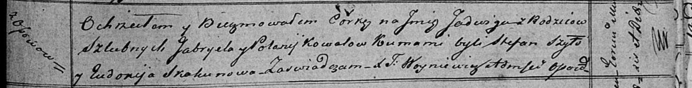

**Коваль Ядвига Габриэлева (Kowalowna Jadwiga)**

12 октября 1819 г -- крещение (НИАБ 136-13-894, лист 103, №56/1819-р
(коп)).

**НИАБ 136-13-894:** Лист 103. **Метрическая запись №56/1819-р (ориг).**

Осовская Покровская церковь. 12 октября 1819 года. Метрическая запись о
крещении.

Kowalowna Jadwiga -- дочь родителей с деревни Осовo.

Kowal Gabriel -- отец.

Kowalowa Połonija -- мать.

Szyło Stefan -- кум.

Skakunowa Eudokija -- кума.

Woyniewicz Tomasz -- ксёндз.
