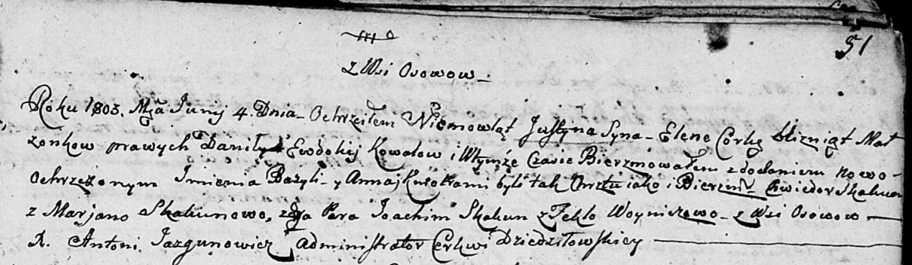

**Коваль (Сушко) Евдокия (Kowalowa Ewdokija z Suszkow)**

29 января 1797 г -- венчание с Данилой Ковалём с деревни Осово (НИАБ
136-13-920, лист 4, №3/1797-б (ориг)).

4 июня 1803 г -- крещение близнецов сына Юстына Базыля и дочери Елены
Анны (НИАБ 136-13-894, лист 51, №24/1803-р (ориг)).

27 августа 1805 г -- крещение сына Тадея Балтромея (НИАБ 136-13-894,
лист 58, №37/1805-р (ориг)).

**НИАБ 136-13-920:** Лист 4. **Метрическая запись №3/1797-б (ориг).**

Дедиловичская Покровская церковь. 29 января 1797 года. Метрическая
запись о венчании.

Kowal Daniła -- жених, с деревни Осовo.

Suszkowa Ewdokija -- невеста, девка с деревни Разлитье.

Kowal Sylwester -- свидетель, с деревни Осовo.

Suszko Leon -- свидетель, с деревни Разлитье.

Jazgunowicz Antoni -- ксёндз.

**НИАБ 136-13-894:** Лист 51. **Метрическая запись №24/1803-р (ориг).**

Дедиловичская Покровская церковь. 4 июня 1803 года. Метрическая запись о
крещении.

Kowal Justyn Bazyli -- сын родителей с деревни Осовo, близнец.

Kowalowna Elena Anna -- дочь родителей с деревни Осовo, близнец.

Kowal Daniła -- отец.

Kowalowa Ewdokija -- мать.

Skakun Chwiedor -- кум, крестный отец Юстына, с деревни Осовo.

Skakunowa Marjana -- кума, крестная мать Юстына, с деревни Осовo.

Skakun Joahim -- кум, крестный отец Елены, с деревни Осовo.

Woyniczowa Tekla -- кума, крестная мать Елены, с деревни Осовo.

Jazgunowicz Antoni -- ксёндз.

**НИАБ 136-13-894:** Лист 58. **Метрическая запись №37/1805-р (ориг).**

Дедиловичская Покровская церковь. 27 августа 1805 года. Метрическая
запись о крещении.

Kowal Tadeusz Bałtromiey -- сын родителей с деревни Осовo.

Kowal Daniło -- отец.

Kowalowa Ewdokija -- мать.

Skakun Chwiedor -- кум.

Skakunicha Marjana -- кума.

Jazgunowicz Antoni -- ксёндз.
