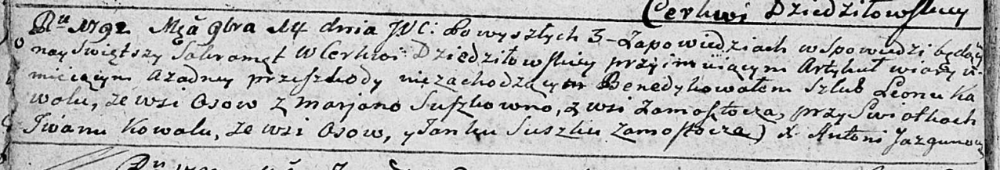

**Коваль Евдокия (Kowalowa Ewdokija)**

23 июня 1790 г -- крещение сына Яна (НИАБ 136-13-894, лист 10,
№35/1790-р (ориг)).

**НИАБ 136-13-894:** Лист 10. **Метрическая запись №35/1790-р (ориг).**

{width="6.496527777777778in"
height="0.7697408136482939in"}

Дедиловичская Покровская церковь. 23 июня 1790 года. Метрическая запись
о крещении.

Kowal Jan -- сын родителей с деревни Осово.

Kowal Jwan -- отец.

Kowalowa Ewdokija -- мать.

Suszko Janka - кум.

Audziuchowiczowa Rypina - кума.

Jazgunowicz Antoni -- ксёндз.
