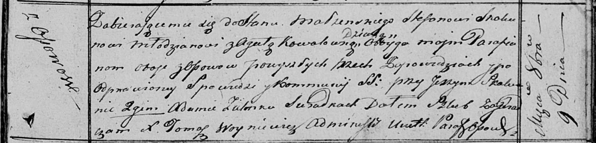

**Скакун (в девичестве Коваль) Агата (Skakunowa Agata z Kowalow)**

9 октября 1817 г -- венчание с молодым Стефаном Скакуном с деревни Осово
(НИАБ 136-13-920, лист 24, №6/1817-б (ориг))

**НИАБ 136-13-920:** Лист 24. **Метрическая запись №6/1817-б (ориг).**

Осовская Покровская церковь. 9 октября 1817 года. Запись о венчании.

Skakun Stefan -- жених, молодой, парафии Осовской, с деревни Осово.

Kowałowna Agata -- невеста, девка, парафии Осовской, с деревни Осово.

Skakun Jerzy -- свидетель.

Zielonka Adam -- свидетель.

Woyniewicz Tomasz -- ксёндз.
