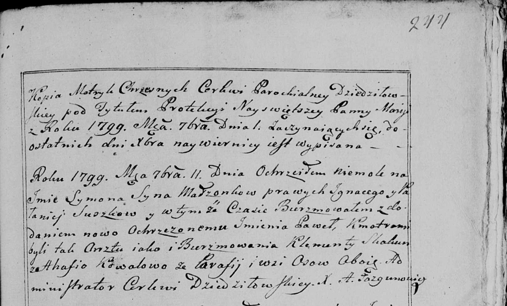

**Коваль Агафия (Kowalowa Ahafija)**

11 сентября 1799 г -- крестная мать Сымона Павла, сына Сушков Игнацыя и
Паланеи с деревни Осово (НИАБ 136-13-938, лист 244, №33/1799-р (коп)).

**НИАБ 136-13-938:** Лист 244. **Метрическая запись №33/1799-р (коп).**

(См. тж. НИАБ 136-13-894, лист 39об, №35/1799-р (ориг); РГИА 823-2-18,
лист 271, №33/1799-р (коп))

{width="6.496527777777778in"
height="3.925in"}

Дедиловичская Покровская церковь. 11 сентября 1799 года. Метрическая
запись о крещении.

Suszko Symon Paweł -- сын родителей с деревни \[Осовo\].

Suszko Jgnacy -- отец.

Suszkowa Pałanieja -- мать.

Skakun Klementy -- кум, парафианин Осовский, с деревни Осово.

Kowalowa Ahafija - кума, парафианка Осовская, с деревни Осово.

Jazgunowicz Antoni -- ксёндз.
