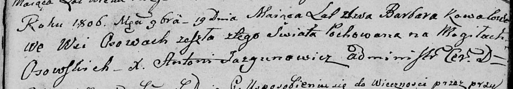

**Коваль Варвара (Kowalowa Barbara)**

19 ноября 1806 г -- отпевание, умерла в возрасте 2 лет (родилась около
1804) (НИАБ 136-13-919, лист 17, №9/1806-у (ориг)).

**НИАБ 136-13-919:** Лист 17. **Метрическая запись №9/1806-у (ориг).**

{width="6.496527777777778in"
height="1.1291666666666667in"}

Дедиловичская Покровская церковь. 19 ноября 1806 года. Метрическая
запись об отпевании.

Kowalowa Barbara -- умершая, 2 года, с деревни Осово, похоронена на
кладбище деревни Осово.

Jazgunowicz Antoni -- ксёндз.
