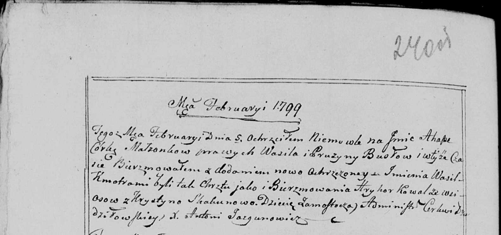
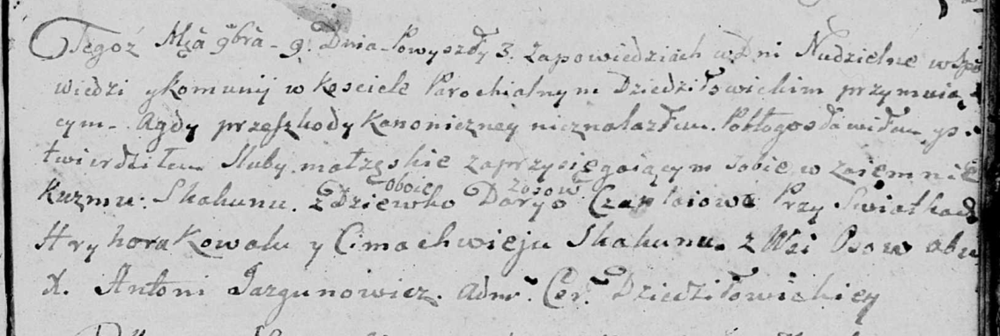

**Коваль Грыгор (Kowal Hryhor)**

5 февраля 1799 г -- крестный отец Агапы, дочери Буслов Василя и Прузыны
с деревни Замосточье (НИАБ 136-13-938, лист 240об, №5/1799-р (коп))

9 ноября 1807 г -- свидетель венчания Кузьмы Скакуна с деревни Осово с
девкой Дарыей Чапляй с деревни Осово (НИАБ 136-13-920, лист 13,
№10/1807-б (ориг)).

**НИАБ 136-13-938:** Лист 240об. **Метрическая запись №5/1799-р (коп).**

(См. тж. НИАБ 136-13-894, лист 38, №5/1799-р (ориг); РГИА 823-2-18, лист
268, №5/1799-р (коп))

Дедиловичская Покровская церковь. 5 февраля 1799 года. Метрическая
запись о крещении.

Busłowa Ahapa -- дочь родителей с деревни Замосточье.

Busła Wasil -- отец.

Busłowa Pruzyna -- мать.

Kowal Hryhor -- кум, с деревни Осово.

Skakunowa Krystyna - кума.

Jazgunowicz Antoni -- ксёндз.

**НИАБ 136-13-920:** Лист 13. **Метрическая запись №10/1807-б (ориг).**

Дедиловичская Покровская церковь. 9 ноября 1807 года. Метрическая запись
о венчании.

Skakun Kuzma -- жених, с деревни Осовo.

Czaplaiowa Darya -- невеста, девка, с деревни Осовo.

Kowal Hryhor -- свидетель, с деревни Осовo.

Skakun Cimachwiey -- свидетель, с деревни Осовo.

Jazgunowicz Antoni -- ксёндз.
