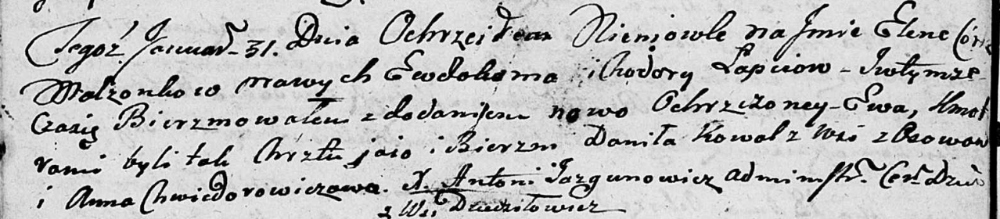

**Коваль Данила (Kowal Daniła)**

31 января 1803 г -- крестный отец Елены Евы, дочери Лапецов Евдокима и
Ходоры (НИАБ 136-13-894, лист 49об, №4/1803-р (коп)).

**НИАБ 136-13-894:** Лист 49об. **Метрическая запись №4/1803-р (ориг).**

Дедиловичская Покровская церковь. 31 января 1803 года. Метрическая
запись о крещении.

Łapciowna Elena Ewa -- дочь.

Łapać Ewdokim -- отец.

Łapciowa Chodora -- мать.

Kowal Daniła -- кум, с деревни Осовo.

Chwiedorowiczowa Anna -- кума.

Jazgunowicz Antoni -- ксёндз.
