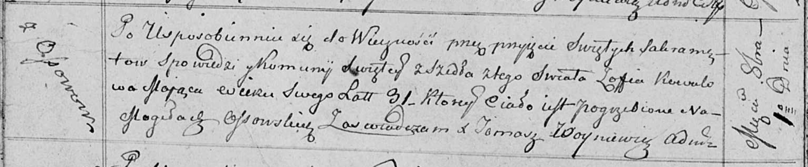

**Коваль Зофья (Kowalowa Zofia, Zosia)**

20 ноября 1799 г -- крестная мать Андрея, сына Кикилов Павла и Ульяны с
деревни Осово (НИАБ 136-13-894, лист 40, №49/1799-р (коп), НИАБ
136-13-938, лист 245, №44/1799-р (коп)).

2 февраля 1805 г -- крестная мать Сымона Игнацыя, сына Скакунов Андрея и
Настасьи с деревни Осово (НИАБ 136-13-894, лист 56об, №14/1805-р
(ориг)).

1 октября 1813 г -- отпевание, умерла в возрасте 31 год (родилась около
1782 г) (НИАБ 136-13-919, лист 27об, №50/1813-у (ориг)).

**НИАБ 136-13-894:** Лист 40. **Метрическая запись №49/1799-р (ориг).**

Дедиловичская Покровская церковь. 20 ноября 1799 года. Метрическая
запись о крещении.

Kikiło Andrzey -- сын родителей с деревни Осовo.

Kikiło Paweł -- отец.

Kikiłowa Ullana -- мать.

Skakun Leon -- кум, с деревни Осовo.

Kowalowa Zofia -- кума,с деревни Осовo.

Jazgunowicz Antoni -- ксёндз.

**НИАБ 136-13-938:** Лист 245. **Метрическая запись №44/1799-р (коп).**

(См. тж. НИАБ 136-13-894, лист 40, №49/1799-р (ориг); РГИА 823-2-18,
лист 273, №48/1799-р (коп))

Дедиловичская Покровская церковь. 6 ноября 1799 года. Метрическая запись
о крещении.

Kikiło Andrzey Eliasz -- сын родителей с деревни Клинники \[Осово\].

Kikiło Paweł -- отец.

Kikiłowa Ullana -- мать.

Skakun Leon -- кум, с деревни \[Осовo\].

Kowalowa Zofia - кума, с деревни \[Осовo\].

Jazgunowicz Antoni -- ксёндз.

**НИАБ 136-13-894:** Лист 56об. **Метрическая запись №14/1805-р
(ориг).**

Дедиловичская Покровская церковь. 2 февраля 1805 года. Метрическая
запись о крещении.

Skakun Symon Jgnacy -- сын родителей с деревни Осовo.

Skakun Andrzey -- отец.

Skakunowa Nastazya -- мать.

Skakun Maciey -- кум, с деревни Осовo.

Kowalowa Zosia -- кума, с деревни Осовo.

Jazgunowicz Antoni -- ксёндз.

**НИАБ 136-13-919:** Лист 27об. **Метрическая запись №50/1813-у
(ориг).**

Осовская униатская церковь. 1 октября 1813 года. Метрическая запись об
отпевании.

Kowalowa Zofia -- умершая, 31 год, с деревни Осово, похоронена на
кладбище деревни Осово.

Woyniewicz Tomasz -- ксёндз.
