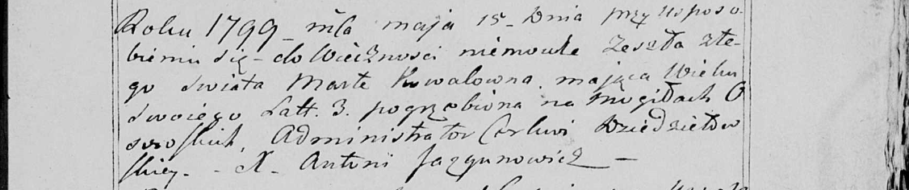

**Коваль Марта (Kowalowa Marta)**

15 мая 1799 г -- отпевание, умерла в возрасте 3 лет (родилась около 1796
г) (НИАБ 136-13-919, лист 9, №8/1799-у (ориг), НИАБ 136-13-938, лист
251, №8/1799-у (коп)).

**НИАБ 136-13-919:** Лист 9. **Метрическая запись №8/1799-у (ориг).**

{width="6.496527777777778in"
height="0.7902777777777777in"}

Дедиловичская Покровская церковь. 15 мая 1799 года. Метрическая запись
об отпевании.

Kowalowa Marta -- умершая, 3 года, с деревни Осово, похоронена на
кладбище деревни Осово.

Jazgunowicz Antoni -- ксёндз.

**НИАБ 136-13-938:** Лист 251. **Метрическая запись №8/1799-у (коп).**

(См. тж. НИАБ 136-13-919, Лист 9. Метрическая запись №8/1799-у (ориг))

{width="6.496527777777778in"
height="1.3618055555555555in"}

Дедиловичская Покровская церковь. 15 мая 1799 года. Метрическая запись
об отпевании.

Kowalowna Marta -- умершая, 3 года, с деревни \[Осово\], похоронена на
кладбище деревни Осово.

Jazgunowicz Antoni -- ксёндз.
