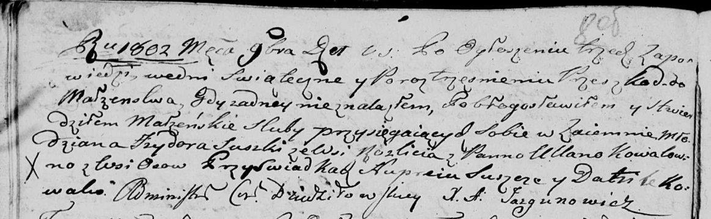

**Сушко (Коваль) Ульяна (Suszkowa (Kowalowna) Ullana)**

2 ноября 1802 г -- венчание с молодым Изыдором Сушко с деревни Разлитье
(НИАБ 136-13-920, лист 8об, №5/1802-б (ориг)).

**НИАБ 136-13-920:** Лист 8об. **Метрическая запись №5/1802-б (ориг).**

Дедиловичская Покровская церковь. 2 ноября 1802 года. Метрическая запись
о венчании.

Suszko Jzydor -- жених, молодой, с деревни Разлитье.

Kowalowna Ullana -- невеста, с деревни Осовo.

Suszko Nuprey -- свидетель.

Kowal Daniło -- свидетель.

Jazgunowicz Antoni -- ксёндз.
