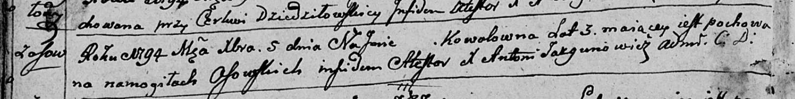

**Коваль (Kowalowna)**

5 декабря 1794 г -- отпевание, умерла в возрасте 3 года (родилась около
1791 г) (НИАБ 136-13-919, лист 3об, №63/1794-у (ориг)).

**НИАБ 136-13-919:** Лист 3об. **Метрическая запись №63/1794-у (ориг).**

Дедиловичская Покровская церковь. 5 декабря 1794 года. Метрическая
запись об отпевании.

Kowalowna -- умершая, 3 года, с деревни Осово, похоронена на кладбище
деревни Осово.

Jazgunowicz Antoni -- ксёндз.
