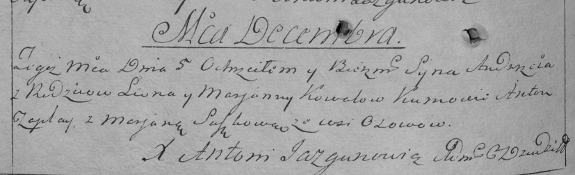

**Коваль Андрей Леонов (Kowal Andrzey)**

5 декабря 1793 г -- крещение (НИАБ 136-13-894, лист 21, №83/1793-р
(ориг)), (РГИА 823-2-18, лист 248об, №49/1793-р (коп)).

**НИАБ 136-13-894:** Лист 21. **Метрическая запись №83/1793-р (ориг).**

{width="6.496527777777778in"
height="0.8562357830271216in"}

Дедиловичская Покровская церковь. 5 декабря 1793 года. Метрическая
запись о крещении.

Kowal Andrzey -- сын селян с деревни Осовo.

Kowal Leon -- отец.

Kowalowa Marjana-- мать.

Abramowicz Andrzey, JP -- кум, шляхтич.

Majewska Anna - кума.

Czaplay Anton -- ассистент.

Suszkowa Marjana -- ассистентка.

Jazgunowicz Antoni -- ксёндз.

**РГИА 823-2-18:** Лист 248об. **Метрическая запись №49/1793-р (коп).**

{width="6.496527777777778in"
height="1.979861111111111in"}

Дедиловичская Покровская церковь. 5 декабря 1793 года. Метрическая
запись о крещении.

Kowal Andrzey -- сын родителей с деревни Осово.

Kowal Leon -- отец.

Kowalowa Marjanna -- мать.

Czaplay Anton -- кум.

Suszkowa Marjana -- кума.

Jazgunowicz Antoni -- ксёндз.
