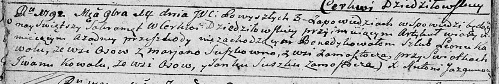

**Коваль Ева Леонова (Kawalowna Ewa)**

2 мая 1809 г -- крещение (НИАБ 136-13-894, лист 74, №21/1809-р (ориг)).

**НИАБ 136-13-894:** Лист 74. **Метрическая запись №21/1809-р (ориг).**

{width="6.496527777777778in"
height="0.7650470253718286in"}

Дедиловичская Покровская церковь. 2 мая 1809 года. Метрическая запись о
крещении .

Kowalowna Ewa -- дочь родителей с деревни Осовo.

Kawal Leon -- отец.

Kowalowa Marjana -- мать.

Czaplay Antoni -- кум.

Skakunowa Xienia -- кума.

Jazgunowicz Antoni -- ксёндз.
