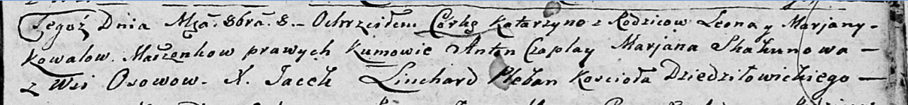

**Коваль Катерина Леонова (Kowalowna Katarzyna)**

8 октября 1805 г -- крещение (НИАБ 136-13-894, лист 58, №41/1805-р
(ориг)).

**НИАБ 136-13-894:** Лист 58. **Метрическая запись №41/1805-р (ориг).**

{width="6.496527777777778in"
height="0.7556594488188977in"}

Дедиловичская Покровская церковь. 8 октября 1805 года. Метрическая
запись о крещении.

Kowalowna Katarzyna -- дочь родителей с деревни Осовo.

Kowal Leon -- отец.

Kowalowa Marjana -- мать.

Czaplay Anton -- кум.

Skakunowa Marjana -- кума.

Linchard Jacek -- ксёндз Дедиловичского костёла.
