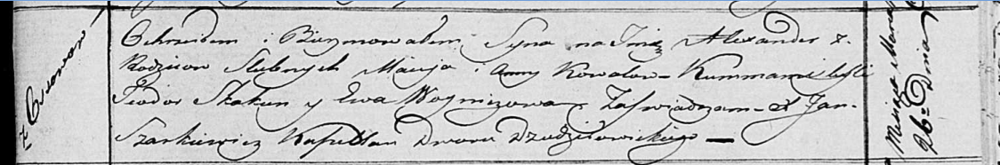

**Коваль Анна (Kowalowa Anna)**

17 мая 1814 г -- крещение дочери Катерыны (НИАБ 136-13-894, лист 89об,
№30/1814-р (ориг)).

26 марта 1817 г -- крещение сына Александра (НИАБ 136-13-894, лист 96,
№21/1817-р (ориг)).

14 июля 1818 г -- крещение дочери Марты (НИАБ 136-13-894, лист 98об,
№21/1818-р (ориг)).

5 июля 1821 г -- крещение дочери Елисаветы (НИАБ 136-13-894, лист 106об,
№31/1821-р (ориг)).

**НИАБ 136-13-894:** Лист 89об. **Метрическая запись №30/1814-р
(ориг).**

Осовская Покровская церковь. 17 мая 1814 года. Метрическая запись о
крещении.

Kowałowna Katerzyna -- дочь родителей с деревни Осовo.

Kował Maciey -- отец.

Kowałowa Anna -- мать.

Rohulski Jhnacy, WJP -- кум, шляхтич, эконом Углянский?.

Bujewiczowa Jadwiga, WJP -- кума, шляхтянка.

Rymond? Adam, JP -- ассистент, шляхтич.

Woyniewiczowna Katerzyna, JP -- ассистентка, шляхтянка.

Skakun Teodor -- ассистент.

Woniczowa Ewa -- ассистентка.

Woyniewicz Tomasz -- ксёндз.

**НИАБ 136-13-894:** Лист 96. **Метрическая запись №21/1817-р (ориг).**

Осовская Покровская церковь. 26 марта 1817 года. Метрическая запись о
крещении.

Kowal Alexander -- сын родителей с деревни Осовo.

Kowal Maciey -- отец.

Kowalowa Anna -- мать.

Skakun Teodor -- кум.

Woyniczowa Ewa -- кума.

Woyniewicz Tomasz -- ксёндз.

**НИАБ 136-13-894:** Лист 98об. **Метрическая запись №21/1818-р
(ориг).**

Осовская Покровская церковь. 14 июля 1818 года. Метрическая запись о
крещении.

Kowalowna Marta -- дочь родителей с деревни Осовo.

Kowal Maciey -- отец.

Kowalowa Anna -- мать.

Skakun Teodor -- кум.

Woyniczowa Ewa -- кума.

Woyniewicz Tomasz -- ксёндз.

**НИАБ 136-13-894:** Лист 106об. **Метрическая запись №31/1821-р
(ориг).**

Осовская Покровская церковь. 5 июля 1821 года. Метрическая запись о
крещении.

Kowalowna Elżbieta -- дочь родителей с деревни Осовo.

Kowal Maciey -- отец.

Kowalowa Anna -- мать.

Skakun Teodor -- кум.

Woyniczowa Ewa -- кума.

Woyniewicz Tomasz -- ксёндз.
