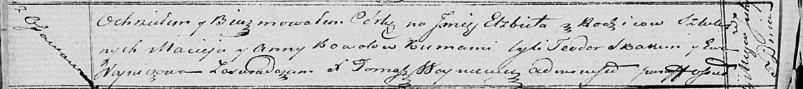

**Коваль Елисавета Мацеева (Kowalowna Elżbieta)**

5 июля 1821 г -- крещение дочери Елисаветы (НИАБ 136-13-894, лист 106об,
№31/1821-р (ориг)).

**НИАБ 136-13-894:** Лист 106об. **Метрическая запись №31/1821-р
(ориг).**

{width="6.496527777777778in"
height="0.7328619860017498in"}

Осовская Покровская церковь. 5 июля 1821 года. Метрическая запись о
крещении.

Kowalowna Elżbieta -- дочь родителей с деревни Осовo.

Kowal Maciey -- отец.

Kowalowa Anna -- мать.

Skakun Teodor -- кум.

Woyniczowa Ewa -- кума.

Woyniewicz Tomasz -- ксёндз.
