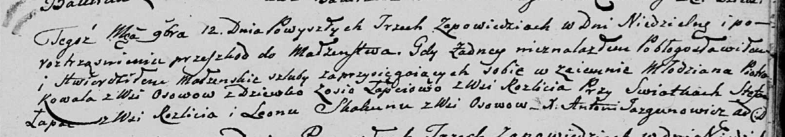
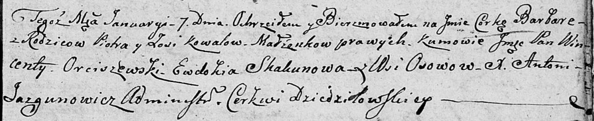

**Коваль (Лапец) Зося (Kowalowa Zosia z Łapciow)**

12 ноября 1804 г -- венчание с молодым Петром Ковалём с деревни Осово
(НИАБ 136-13-920, лист 11, №12/1804-б (коп)).

7 января 1806 г -- крещение дочери Варвары (НИАБ 136-13-894, лист 59,
№2/1806-р (коп)).

**НИАБ 136-13-920:** Лист 11. **Метрическая запись №12/1804-б (ориг).**

Дедиловичская Покровская церковь. 12 ноября 1804 года. Метрическая
запись о венчании.

Kowal Piotr -- жених, молодой, с деревни Осовo.

Łapciowa Zosia -- невеста, девка, с деревни Разлитье.

Łapac Stefan -- свидетель, с деревни Разлитье.

Skakun Leon -- свидетель, с деревни Осовo.

Jazgunowicz Antoni -- ксёндз.

**НИАБ 136-13-894:** Лист 59. **Метрическая запись №2/1806-р (ориг).**

Дедиловичская Покровская церковь. 7 января 1806 года. Метрическая запись
о крещении.

Kowalowna Barbara -- дочь родителей с деревни Осовo.

Kowal Piotr -- отец.

Kowalowa Zosia -- мать.

Orciszewski Wincenty, JP -- кум, шляхтич.

Skakunowa Ewdokija -- кума.

Jazgunowicz Antoni -- ксёндз.
