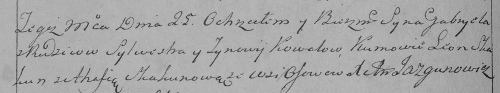

**Коваль Габриэль Сильвестров (Kowal Gabriel)**

25 марта 1794 г -- крещение (НИАБ 136-13-894, лист 21об, №15/1794-р
(ориг)), (РГИА 823-2-18, лист 249об, №10/1794-р (коп)).

Лист 21-об. **Метрическая запись №15/1794-р (ориг).**

{width="6.496527777777778in"
height="1.1666797900262467in"}

Дедиловичская Покровская церковь. 25 марта 1794 года. Метрическая запись
о крещении.

Kawal Gabriel -- сын родителей с деревни Осовo.

Kawal Sylwester -- отец.

Kawalowa Zynowija -- мать.

Skakun Leon - кум.

Skakunowa Ahafija - кума.

Jazgunowicz Antoni -- ксёндз.

**РГИА 823-2-18:** Лист 249об. **Метрическая запись №10/1794-р (коп).**

{width="6.496527777777778in"
height="1.2173611111111111in"}

Дедиловичская Покровская церковь. 25 марта 1794 года. Метрическая запись
о крещении.

Kowal Gabriel -- сын родителей с деревни Осово.

Kowal Sylwester -- отец.

Kowalowa Zynowija -- мать.

Skakun Leon -- кум.

Skakunowa Ahafija -- кума.

Jazgunowicz Antoni -- ксёндз.
