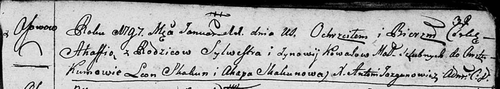
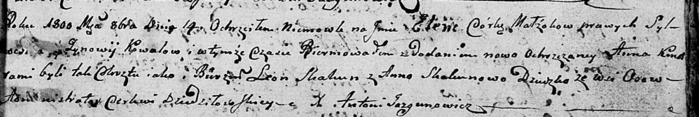

**Коваль Зыновия (Kowalowa Zynowija, Zynowia)**

1 августа 1787 г -- крещение сына Мацея (НИАБ 136-13-894, лист 2об,
№36/1787-р (ориг)), (НИАБ 136-13-894, лист 2об, №36/1787-р (ориг)).

28 октября 1789 г -- крещение дочери Марты (НИАБ 136-13-894, лист 8,
№57/1789-р (ориг)).

30 марта 1791 г -- крещение дочери Зоси (НИАБ 136-13-894, лист 12об,
№14/1791-р (ориг)).

25 марта 1794 г -- крещение сына Габриэля (НИАБ 136-13-894, лист 21об,
№15/1794-р (ориг)), (РГИА 823-2-18, лист 249об, №10/1794-р (коп)).

11 января 1797 г -- крещение дочери Агафии (НИАБ 136-13-894, лист 32,
№3/1797-р (ориг)), (РГИА 823-2-18, лист 258об, №3/1797-р (коп)).

16 сентября 1800 г -- крестная мать Базыля Йозефата, сына Скакунов
Демьяна и Ксени с деревни Осово (НИАБ 136-13-949, лист 103об, №28/1800-р
(коп)).

14 октября 1800 г -- крещение дочери Елены Анны (НИАБ 136-13-894, лист
42, №30/1800-р (ориг), НИАБ 136-13-949, лист 103об, №33/1800-р (коп)).

**НИАБ 136-13-894:** Лист 2об. **Метрическая запись №36/1787-р (ориг).**

Дедиловичская Покровская церковь. 1 августа 1787 года. Метрическая
запись о крещении.

Kowal Maciej - сын родителей с деревни Осово.

Kowal Sylwester -- отец.

Kowalowa Zynowija -- мать.

Skakun Leon - кум.

Skakunowa Ahapa - кума.

Jazgunowicz Antoniusz -- ксёндз.

**РГИА 823-2-18:** Лист 234об. **Метрическая запись №21/1787-р (коп).**

Дедиловичская Покровская церковь. 1 августа 1787 года. Метрическая
запись о крещении.

Kowal Maciey -- сын родителей с деревни Осово.

Kowal Sylwester -- отец.

Kowalowa Zynowija -- мать.

Skakun Leon -- кум.

Skakunowa Ahapa - кума.

Jazgunowicz Antoni -- ксёндз.

**НИАБ 136-13-894:** Лист 8. **Метрическая запись №57/1789-р (ориг).**

Дедиловичская Покровская церковь. 28 октября 1789 года. Метрическая
запись о крещении.

Kowalowna Marta -- дочь родителей с деревни Осово.

Kowal Sieluta -- отец.

Kowalowa Zynowija -- мать.

Skakun Lawon - кум.

Skakunicha Ahapa - кума.

Jazgunowicz Antoni -- ксёндз.

**НИАБ 136-13-894:** Лист 12об. **Метрическая запись №14/1791-р
(ориг).**

Дедиловичская Покровская церковь. 30 марта 1791 года. Метрическая запись
о крещении.

Kowalowna Zosia -- дочь родителей с деревни Осово.

Kowal Silwester -- отец.

Kowalowa Zynowia -- мать.

Skakun Leon - кум.

Skakunicha Anna - кума.

Jazgunowicz Antoni -- ксёндз.

Лист 21-об. **Метрическая запись №15/1794-р (ориг).**

Дедиловичская Покровская церковь. 25 марта 1794 года. Метрическая запись
о крещении.

Kawal Gabriel -- сын родителей с деревни Осовo.

Kawal Sylwester -- отец.

Kawalowa Zynowija -- мать.

Skakun Leon - кум.

Skakunowa Ahafija - кума.

Jazgunowicz Antoni -- ксёндз.

**РГИА 823-2-18:** Лист 249об. **Метрическая запись №10/1794-р (коп).**

Дедиловичская Покровская церковь. 25 марта 1794 года. Метрическая запись
о крещении.

Kowal Gabriel -- сын родителей с деревни Осово.

Kowal Sylwester -- отец.

Kowalowa Zynowija -- мать.

Skakun Leon -- кум.

Skakunowa Ahafija -- кума.

Jazgunowicz Antoni -- ксёндз.

**НИАБ 136-13-894:** Лист 32. **Метрическая запись №3/1797-р (ориг).**

Дедиловичская Покровская церковь. 11 января 1797 года. Метрическая
запись о крещении.

Kowalowna Ahafia -- дочь родителей с деревни Осовo.

Kowal Sylwester -- отец.

Kowalowa Zynowija -- мать.

Skakun Leon - кум.

Skakunowa Ahapa - кума.

Jazgunowicz Antoni -- ксёндз.

**РГИА 823-2-18:** Лист 258об. **Метрическая запись №3/1797-р (коп).**

Дедиловичская Покровская церковь. 11 января 1797 года. Метрическая
запись о крещении.

Kowalowna Ahafia -- дочь родителей с деревни Осово.

Kowal Sylwester -- отец.

Kowalowa Zynowia -- мать.

Skakun Leon -- кум.

Skakunowa Ahapa -- кума.

Jazgunowicz Antoni -- ксёндз.

**НИАБ 136-13-949:** Лист 103об. **Метрическая запись №28/1800-р
(коп).**

(См. тж.: НИАБ 136-13-894, лист 42, №25/1800-р (ориг))

Дедиловичская Покровская церковь. 16 сентября 1800 года. Метрическая
запись о крещении.

Skakun Bazyli Jozefat -- сын родителей с деревни Осово.

Skakun Dziemjan -- отец.

Skakunowa Xienia -- мать.

Kowal Daniło -- кум, с деревни Осово.

Kowalowa Zynowia - кума, с деревни Осово.

Jazgunowicz Antoni -- ксёндз.

**НИАБ 136-13-894:** Лист 42. **Метрическая запись №30/1800-р (ориг).**

Дедиловичская Покровская церковь. 14 октября 1800 года. Метрическая
запись о крещении.

Kоwalowna Elena Anna -- дочь родителей с деревни Осовo.

Kowal Sylwester -- отец.

Kowalowa Zynowija -- мать.

Skakun Leon -- кум.

Skakunowa Anna -- кума.

Jazgunowicz Antoni -- ксёндз.
