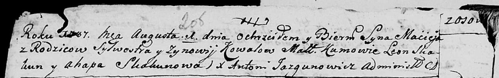
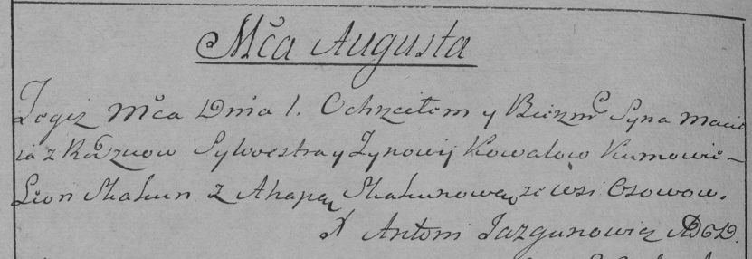

**Коваль Мацей Сильвестров (Kowal Maciey)**

1 августа 1787 г -- крещение сына Мацея (НИАБ 136-13-894, лист 2об,
№36/1787-р (ориг)), (НИАБ 136-13-894, лист 2об, №36/1787-р (ориг)).

**НИАБ 136-13-894:** Лист 2об. **Метрическая запись №36/1787-р (ориг).**

Дедиловичская Покровская церковь. 1 августа 1787 года. Метрическая
запись о крещении.

Kowal Maciej - сын родителей с деревни Осово.

Kowal Sylwester -- отец.

Kowalowa Zynowija -- мать.

Skakun Leon - кум.

Skakunowa Ahapa - кума.

Jazgunowicz Antoniusz -- ксёндз.

**РГИА 823-2-18:** Лист 234об. **Метрическая запись №21/1787-р (коп).**

Дедиловичская Покровская церковь. 1 августа 1787 года. Метрическая
запись о крещении.

Kowal Maciey -- сын родителей с деревни Осово.

Kowal Sylwester -- отец.

Kowalowa Zynowija -- мать.

Skakun Leon -- кум.

Skakunowa Ahapa - кума.

Jazgunowicz Antoni -- ксёндз.
