**Коваль Сыльвестр, Сялюта (Kowal Silvester, Sylwester, Sieluta)**

1 августа 1787 г -- крещение сына Мацея (НИАБ 136-13-894, лист 2об,
№36/1787-р (ориг)), (НИАБ 136-13-894, лист 2об, №36/1787-р (ориг)).

28 октября 1789 г -- крещение дочери Марты (НИАБ 136-13-894, лист 8,
№57/1789-р (ориг)).

30 марта 1791 г -- крещение дочери Зоси (НИАБ 136-13-894, лист 12об,
№14/1791-р (ориг)).

25 марта 1794 г -- крещение сына Габриэля (НИАБ 136-13-894, лист 21об,
№15/1794-р (ориг)), (РГИА 823-2-18, лист 249об, №10/1794-р (коп)).

11 января 1797 г -- крещение дочери Агафии (НИАБ 136-13-894, лист 32,
№3/1797-р (ориг)), (РГИА 823-2-18, лист 258об, №3/1797-р (коп)).

29 января 1797 г -- свидетель венчания Данилы Коваля с деревни Осово с
девкой Евдокией Сушко с деревни Разлитье (НИАБ 136-13-920, лист 4,
№3/1797-б (ориг)).

14 октября 1800 г -- крещение дочери Елены Анны (НИАБ 136-13-894, лист
42, №30/1800-р (ориг), НИАБ 136-13-949, лист 103об, №33/1800-р (коп)).

2 февраля 1802 г -- крестный отец Игнация Базыля, сына Скакунов Никипера
и Марьяны с деревни Лустичи (НИАБ 136-13-894, лист 45об, №4/1802-р
(ориг)).

10 мая 1803 г -- крестный отец Миколая Бенедыкта, сына Чапляев Яна и
Ксени с деревни Осово (НИАБ 136-13-894, лист 50об, №21/1803-р (ориг)).

21 мая 1815 г -- отпевание, умер в возрасте 70 лет (родился около 1745
г) (НИАБ 136-13-919, лист 29, №16/1815-у (ориг)).

**НИАБ 136-13-894:** Лист 2об. **Метрическая запись №36/1787-р (ориг).**

Дедиловичская Покровская церковь. 1 августа 1787 года. Метрическая
запись о крещении.

Kowal Maciej - сын родителей с деревни Осово.

Kowal Sylwester -- отец.

Kowalowa Zynowija -- мать.

Skakun Leon - кум.

Skakunowa Ahapa - кума.

Jazgunowicz Antoniusz -- ксёндз.

**РГИА 823-2-18:** Лист 234об. **Метрическая запись №21/1787-р (коп).**

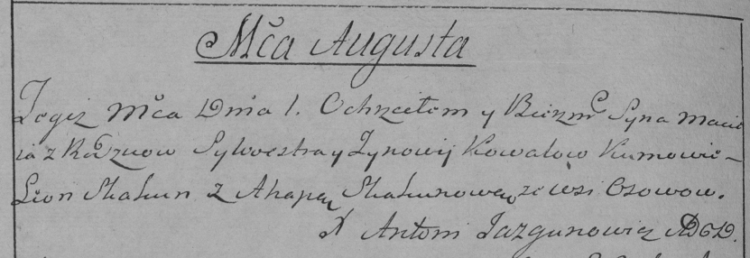

Дедиловичская Покровская церковь. 1 августа 1787 года. Метрическая
запись о крещении.

Kowal Maciey -- сын родителей с деревни Осово.

Kowal Sylwester -- отец.

Kowalowa Zynowija -- мать.

Skakun Leon -- кум.

Skakunowa Ahapa - кума.

Jazgunowicz Antoni -- ксёндз.

**НИАБ 136-13-894:** Лист 8. **Метрическая запись №57/1789-р (ориг).**

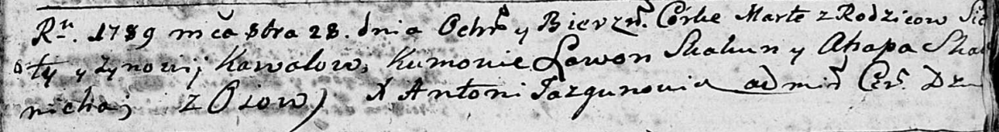

Дедиловичская Покровская церковь. 28 октября 1789 года. Метрическая
запись о крещении.

Kowalowna Marta -- дочь родителей с деревни Осово.

Kowal Sieluta -- отец.

Kowalowa Zynowija -- мать.

Skakun Lawon - кум.

Skakunicha Ahapa - кума.

Jazgunowicz Antoni -- ксёндз.

**НИАБ 136-13-894:** Лист 12об. **Метрическая запись №14/1791-р
(ориг).**

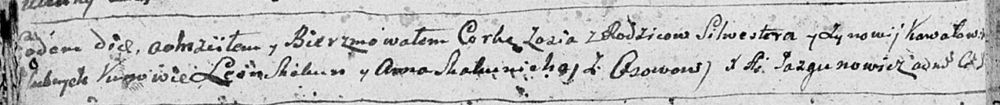

Дедиловичская Покровская церковь. 30 марта 1791 года. Метрическая запись
о крещении.

Kowalowna Zosia -- дочь родителей с деревни Осово.

Kowal Silwester -- отец.

Kowalowa Zynowia -- мать.

Skakun Leon - кум.

Skakunicha Anna - кума.

Jazgunowicz Antoni -- ксёндз.

**НИАБ 136-13-894:** Лист 21-об. **Метрическая запись №15/1794-р
(ориг).**

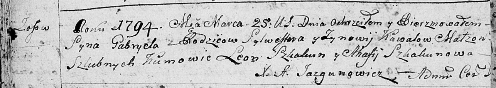

Дедиловичская Покровская церковь. 25 марта 1794 года. Метрическая запись
о крещении.

Kawal Gabriel -- сын родителей с деревни Осовo.

Kawal Sylwester -- отец.

Kawalowa Zynowija -- мать.

Skakun Leon - кум.

Skakunowa Ahafija - кума.

Jazgunowicz Antoni -- ксёндз.

**РГИА 823-2-18:** Лист 249об. **Метрическая запись №10/1794-р (коп).**

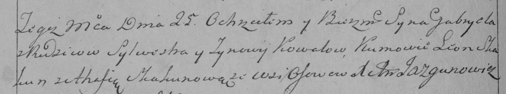

Дедиловичская Покровская церковь. 25 марта 1794 года. Метрическая запись
о крещении.

Kowal Gabriel -- сын родителей с деревни Осово.

Kowal Sylwester -- отец.

Kowalowa Zynowija -- мать.

Skakun Leon -- кум.

Skakunowa Ahafija -- кума.

Jazgunowicz Antoni -- ксёндз.

**НИАБ 136-13-894:** Лист 32. **Метрическая запись №3/1797-р (ориг).**

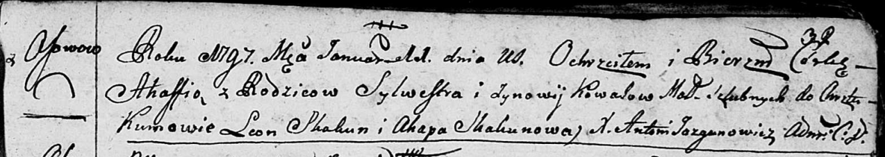

Дедиловичская Покровская церковь. 11 января 1797 года. Метрическая
запись о крещении.

Kowalowna Ahafia -- дочь родителей с деревни Осовo.

Kowal Sylwester -- отец.

Kowalowa Zynowija -- мать.

Skakun Leon - кум.

Skakunowa Ahapa - кума.

Jazgunowicz Antoni -- ксёндз.

**РГИА 823-2-18:** Лист 258об. **Метрическая запись №3/1797-р (коп).**

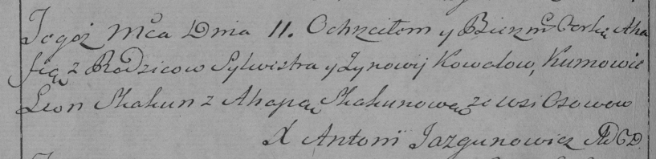

Дедиловичская Покровская церковь. 11 января 1797 года. Метрическая
запись о крещении.

Kowalowna Ahafia -- дочь родителей с деревни Осово.

Kowal Sylwester -- отец.

Kowalowa Zynowia -- мать.

Skakun Leon -- кум.

Skakunowa Ahapa -- кума.

Jazgunowicz Antoni -- ксёндз.

**НИАБ 136-13-920:** Лист 4. **Метрическая запись №3/1797-б (ориг).**

Дедиловичская Покровская церковь. 29 января 1797 года. Метрическая
запись о венчании.

Kowal Daniła -- жених, с деревни Осовo.

Suszkowa Ewdokija -- невеста, девка с деревни Разлитье.

Kowal Sylwester -- свидетель, с деревни Осовo.

Suszko Leon -- свидетель, с деревни Разлитье.

Jazgunowicz Antoni -- ксёндз.

**НИАБ 136-13-894:** Лист 42. **Метрическая запись №30/1800-р (ориг).**

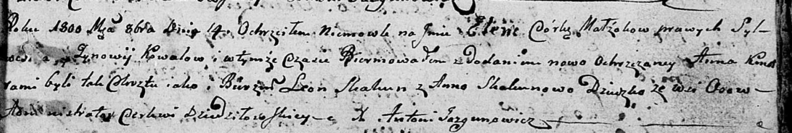

Дедиловичская Покровская церковь. 14 октября 1800 года. Метрическая
запись о крещении.

Kоwalowna Elena Anna -- дочь родителей с деревни Осовo.

Kowal Sylwester -- отец.

Kowalowa Zynowija -- мать.

Skakun Leon -- кум.

Skakunowa Anna -- кума.

Jazgunowicz Antoni -- ксёндз.

**НИАБ 136-13-949:** Лист 103об. **Метрическая запись №33/1800-р
(коп).**

(См. тж.: НИАБ 136-13-894, лист 42, №30/1800-р (ориг))

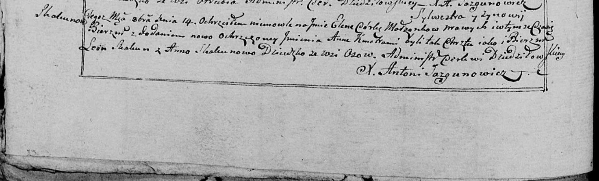

Дедиловичская Покровская церковь. 14 октября 1800 года. Метрическая
запись о крещении.

Skakunowna \[Kowalowna\] Elena Anna -- дочь родителей с деревни Осово.

Skakun \[Kowal\] Sylwester -- отец.

Skakunowa \[Kowalowa\] Zynowia -- мать.

Skakun Leon -- кум.

Skakunowa Anna - кума.

Jazgunowicz Antoni -- ксёндз.

**НИАБ 136-13-894:** Лист 45об. **Метрическая запись №4/1802-р (ориг).**

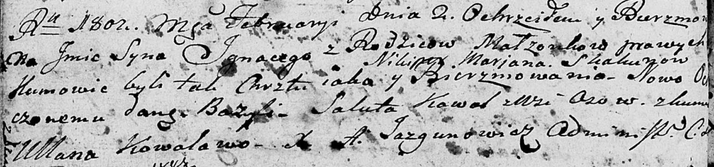

Дедиловичская Покровская церковь. 2 февраля 1802 года. Метрическая
запись о крещении.

Skakun Jgnacy Bazyli -- сын родителей \[с деревни Лустичи\].

Skakun Nikiper -- отец.

Skakunowa Marjana -- мать.

Kawal Saluta -- кум, с деревни Осовo.

Kowalowa Ullana -- кума.

Jazgunowicz Antoni -- ксёндз.

**НИАБ 136-13-894:** Лист 50об. **Метрическая запись №21/1803-р
(ориг).**

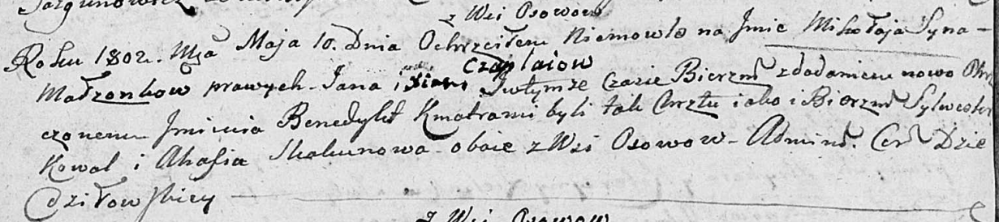

Дедиловичская Покровская церковь. 10 мая 1803 года. Метрическая запись о
крещении.

Czaplay Mikołay Benedykt -- сын родителей с деревни Осовo.

Czaplaj Jan -- отец.

Czaplaiowa Xienia -- мать.

Kowal Sylwester -- кум, с деревни Осовo.

Skakunowa Ahafia -- кума, с деревни Осовo.

Jazgunowicz Antoni -- ксёндз.

**НИАБ 136-13-919:** Лист 29. **Метрическая запись №16/1815-у (ориг).**

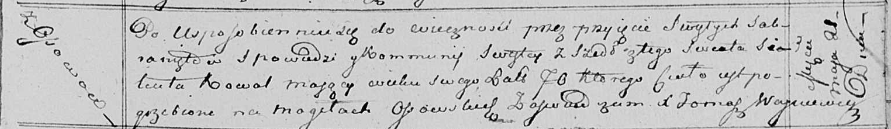

Осовская униатская церковь. 21 мая 1815 года. Метрическая запись об
отпевании.

Sialuta Kowal -- умерший, 70 лет, с деревни Осово, похоронен на кладбище
деревни Осово.

Woyniewicz Tomasz -- ксёндз.
