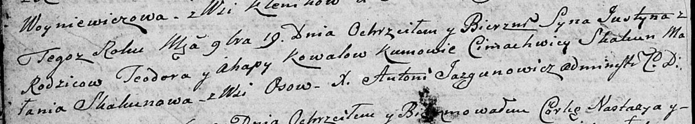

**Коваль Агапа (Kowalowa Ahapa)**

19 ноября 1805 г -- крещение сына Юстына (НИАБ 136-13-894, лист 58,
№56/1805-р (ориг)).

**НИАБ 136-13-894:** Лист 58. **Метрическая запись №56/1805-р (ориг).**

Дедиловичская Покровская церковь. 19 ноября 1805 года. Метрическая
запись о крещении.

Kowal Justyn -- сын родителей с деревни Осовo.

Kowal Teodor -- отец.

Kowalowa Ahapa -- мать.

Skakun Cimachwiey -- кум.

Skakunowa Małania -- кума.

Jazgunowicz Antoni -- ксёндз.
