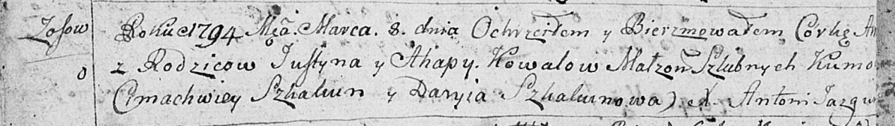
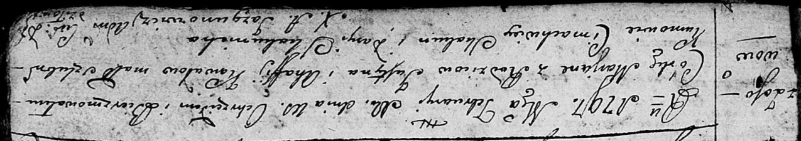

**Коваль (Лепёшко) Агапа, Агафия (Kowalowa Ahapa, Ahafija z
Lapieszkow)**

12 января 1791 г -- венчание с Устином Ковалём с деревни Осово (НИАБ
136-13-894, лист 69, №2/1791-б (ориг)).

8 марта 1794 г -- крещение дочери Анны (НИАБ 136-13-894, лист 21об,
№16/1794-р (ориг)).

10 февраля 1797 г -- крещение дочери Марьяны (НИАБ 136-13-894, лист 32,
№13/1797-р (ориг)).

11 сентября 1799 г -- крестная мать Сымона Павла, сына Сушков Игната и
Паланеи с деревни Осово (НИАБ 136-13-894, лист 39об, №35/1799-р (ориг)).

26 декабря 1801 г -- крещение дочери Настасьи Анны (НИАБ 136-13-894,
лист 45, №35/1801-р (ориг)).

6 января 1808 г -- крещение сына Яна (НИАБ 136-13-894, лист 64,
№1/1808-р (ориг)).

30 мая 1811 г -- крещение дочери Елены (НИАБ 136-13-894, лист 81,
№28/1811-р (ориг)).

2? апреля 1817 г -- крещение сына Габриэля (НИАБ 136-13-894, лист 96,
№27/1817-р (ориг)).

**НИАБ 136-13-894:** Лист 69. **Метрическая запись №2/1791-б (ориг).**

Дедиловичская Покровская церковь. 12 января 1791 года. Метрическая
запись о венчании.

Kawal Uscin -- жених, с деревни Осовo.

Lapieszkowa Ahapa -- невеста.

Kawal Hryhor -- свидетель.

Czaplay Anton -- свидетель.

Jazgunowicz Antoni -- ксёндз.

**НИАБ 136-13-894:** Лист 21-об. **Метрическая запись №16/1794-р
(ориг).**

Дедиловичская Покровская церковь. 8 марта 1794 года. Метрическая запись
о крещении.

Kawalowna Anna -- дочь родителей с деревни Осовo.

Kawal Justyn -- отец.

Kawalowa Ahapa -- мать.

Skakun Cimachwey - кум.

Skakunowa Daryia - кума.

Jazgunowicz Antoni -- ксёндз.

**НИАБ 136-13-894:** Лист 32. **Метрическая запись №13/1797-р (ориг).**

Дедиловичская Покровская церковь. 10 февраля 1797 года. Метрическая
запись о крещении.

Kowalowna Marjana -- дочь родителей с деревни Осовo.

Kowal Justyn -- отец.

Kowalowa Ahafija -- мать.

Skakun Cimachwiey - кум.

Skakunicha Daryia - кума.

Jazgunowicz Antoni -- ксёндз.

**НИАБ 136-13-894:** Лист 39об. **Метрическая запись №35/1799-р
(ориг).**

Дедиловичская Покровская церковь. 11 сентября 1799 года. Метрическая
запись о крещении.

Suszko Symon Paweł -- сын родителей с деревни Осовo.

Suszko Jgnacy -- отец.

Suszkowa Pałanieja -- мать.

Skakun Klamiata -- кум, с деревни Осово.

Kowalowa Ahafia -- кума, с деревни Осово.

Jazgunowicz Antoni -- ксёндз.

**НИАБ 136-13-894:** Лист 45. **Метрическая запись №35/1801-р (ориг).**

Дедиловичская Покровская церковь. 26 декабря 1801 года. Метрическая
запись о крещении.

Kowalowna Nastazyja Anna -- дочь родителей с деревни Осовo.

Kowal Justyn -- отец.

Kowalowa Ahapa -- мать.

Skakun Cimachwiey -- кум.

Skakunowa Daryia -- кума.

Jazgunowicz Antoni -- ксёндз.

**НИАБ 136-13-894:** Лист 64. **Метрическая запись №1/1808-р (ориг).**

Дедиловичская Покровская церковь. 6 января 1808 года. Метрическая запись
о крещении.

Kowal Jan -- сын родителей с деревни Осовo.

Kowal Uscin -- отец.

Kowalowa Ahapa -- мать.

Skakun Cimachwiey -- кум.

Skakunowa Darya -- кума.

Jazgunowicz Antoni -- ксёндз.

**НИАБ 136-13-894:** Лист 81. **Метрическая запись №28/1811-р (ориг).**

Осовская Покровская церковь. 30 мая 1811 года. Метрическая запись о
крещении.

Kowalowna Elena -- дочь родителей с деревни Осовo.

Kowal Justyn -- отец.

Kowalowa Ahafija -- мать.

Skakun Cimachwiey -- кум.

Szuszkowa Marija -- кума.

Woyniewicz Tomasz -- ксёндз.

**НИАБ 136-13-894:** Лист 96. **Метрическая запись №27/1817-р (ориг).**

Осовская Покровская церковь. \[2\] апреля 1817 года. Метрическая запись
о крещении.

Kawal Gabriel -- сын родителей с деревни Осовo.

Kawal Justyn -- отец.

Kowalowa Ahapa -- мать.

Skakun Sawasciey -- кум.

Woyniczowa Połonija -- кума.

Woyniewicz Tomasz -- ксёндз.
