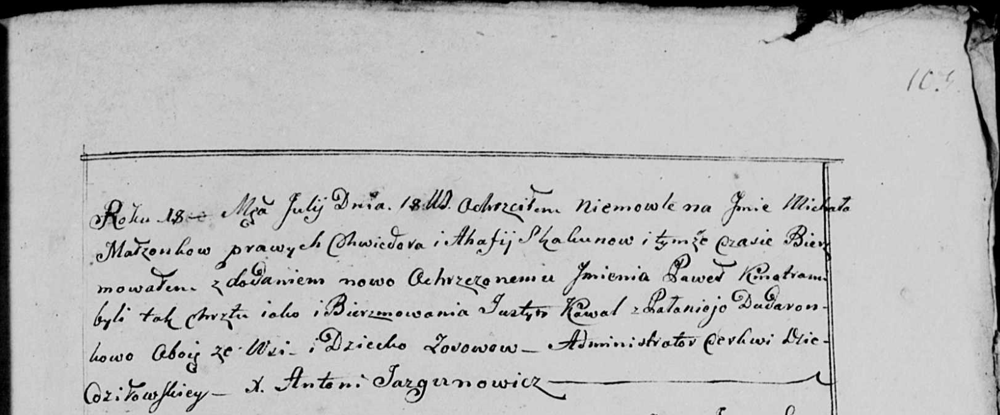

**Коваль Марьяна Юстынова (Kowalowna Marjana)**

10 февраля 1797 г -- крещение (НИАБ 136-13-894, лист 32, №13/1797-р
(ориг)).

**НИАБ 136-13-894:** Лист 32. **Метрическая запись №13/1797-р (ориг).**

{width="6.496527777777778in"
height="1.1512576552930884in"}

Дедиловичская Покровская церковь. 10 февраля 1797 года. Метрическая
запись о крещении.

Kowalowna Marjana -- дочь родителей с деревни Осовo.

Kowal Justyn -- отец.

Kowalowa Ahafija -- мать.

Skakun Cimachwiey - кум.

Skakunicha Daryia - кума.

Jazgunowicz Antoni -- ксёндз.
