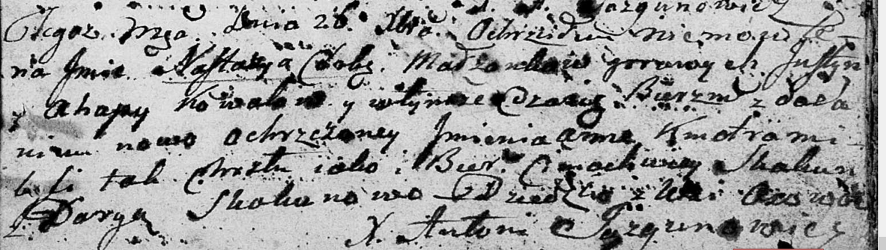

**Коваль Настасья Юстынова (Kowalowna Nastazyja Anna)**

26 декабря 1801 г -- крещение (НИАБ 136-13-894, лист 45, №35/1801-р
(ориг)).

**НИАБ 136-13-894:** Лист 45. **Метрическая запись №35/1801-р (ориг).**

Дедиловичская Покровская церковь. 26 декабря 1801 года. Метрическая
запись о крещении.

Kowalowna Nastazyja Anna -- дочь родителей с деревни Осовo.

Kowal Justyn -- отец.

Kowalowa Ahapa -- мать.

Skakun Cimachwiey -- кум.

Skakunowa Daryia -- кума.

Jazgunowicz Antoni -- ксёндз.
