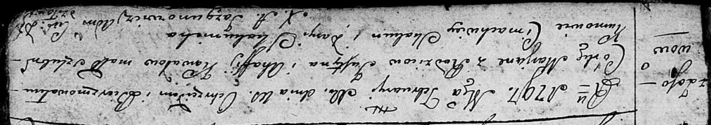

**Коваль Юстын (Kowal, Kawalonek Justyn, Uscin)**

12 января 1791 г -- венчание с Агапой Лепёшко (НИАБ 136-13-894, лист 69,
№2/1791-б (ориг)).

8 марта 1794 г -- крещение дочери Анны (НИАБ 136-13-894, лист 21об,
№16/1794-р (ориг)).

10 февраля 1797 г -- крещение дочери Марьяны (НИАБ 136-13-894, лист 32,
№13/1797-р (ориг)).

18 июля 1800 г -- крестный отец Михала Павла, сына Скакунов Хведора и
Агапы (НИАБ 136-13-949, лист 102об, №19/1800-р (коп), НИАБ 136-13-949,
лист 103, №21/1800-р (коп)).

26 декабря 1801 г -- крещение дочери Настасьи Анны (НИАБ 136-13-894,
лист 45, №35/1801-р (ориг)).

2 января 1805 г -- крестный отец Анны Евы, дочери Соболевских Антыпа и
Ходоры с деревни Осово (НИАБ 136-13-894, лист 56, №4/1805-р (ориг)).

27 мая 1807 г -- крестный отец Марыи, дочери Лесунов Асипа и Хведоры с
деревни Осово (НИАБ 136-13-894, лист 62об, №27/1807-р (ориг)).

6 января 1808 г -- крещение сына Яна (НИАБ 136-13-894, лист 64,
№1/1808-р (ориг)).

30 мая 1811 г -- крещение дочери Елены (НИАБ 136-13-894, лист 81,
№28/1811-р (ориг)).

2? апреля 1817 г -- крещение сына Габриэля (НИАБ 136-13-894, лист 96,
№27/1817-р (ориг)).

**НИАБ 136-13-894:** Лист 69. **Метрическая запись №2/1791-б (ориг).**

{width="6.496527777777778in"
height="1.0500120297462816in"}

Дедиловичская Покровская церковь. 12 января 1791 года. Метрическая
запись о венчании.

Kawal Uscin -- жених, с деревни Осовo.

Lapieszkowa Ahapa -- невеста.

Kawal Hryhor -- свидетель.

Czaplay Anton -- свидетель.

Jazgunowicz Antoni -- ксёндз.

**НИАБ 136-13-894:** Лист 21-об. **Метрическая запись №16/1794-р
(ориг).**

{width="6.496527777777778in"
height="0.9212740594925635in"}

Дедиловичская Покровская церковь. 8 марта 1794 года. Метрическая запись
о крещении.

Kawalowna Anna -- дочь родителей с деревни Осовo.

Kawal Justyn -- отец.

Kawalowa Ahapa -- мать.

Skakun Cimachwey - кум.

Skakunowa Daryia - кума.

Jazgunowicz Antoni -- ксёндз.

**НИАБ 136-13-894:** Лист 32. **Метрическая запись №13/1797-р (ориг).**

{width="6.496527777777778in"
height="1.1512576552930884in"}

Дедиловичская Покровская церковь. 10 февраля 1797 года. Метрическая
запись о крещении.

Kowalowna Marjana -- дочь родителей с деревни Осовo.

Kowal Justyn -- отец.

Kowalowa Ahafija -- мать.

Skakun Cimachwiey - кум.

Skakunicha Daryia - кума.

Jazgunowicz Antoni -- ксёндз.

**НИАБ 136-13-949:** Лист 102об. **Метрическая запись №19/1800-р
(коп).**

(См. тж.: РГИА 823-2-18, лист 276об, №18/1800-р (коп), НИАБ 136-13-894,
лист 41об, №19/1800-р (ориг))

{width="6.496527777777778in"
height="2.015277777777778in"}

Дедиловичская Покровская церковь. 18 июля 1800 года. Метрическая запись
о крещении.

Skakun Michał Paweł -- сын родителей с деревни Осово.

Skakun Chwiedor -- отец.

Skakunowa Ahapa -- мать.

Kawal Justyn -- кум, с деревни Осово.

Dudaronkowa Pałanieja - кума.

Jazgunowicz Antoni -- ксёндз.

**НИАБ 136-13-949:** Лист 103. **Метрическая запись №21/1800-р (коп).
(**См. тж. Лист 102об. Метрическая запись №19/1800-р (коп))

(См. тж.: РГИА 823-2-18, лист 276об, №18/1800-р (коп), НИАБ 136-13-894,
лист 41об, №19/1800-р (ориг))

{width="6.496527777777778in"
height="2.698611111111111in"}

Дедиловичская Покровская церковь. 18 июля 1800 года. Метрическая запись
о крещении.

Skakun Michał Paweł -- сын родителей с деревни Осово.

Skakun Chwiedor -- отец.

Skakunowa Ahafia -- мать.

Kowal Justyn -- кум, с деревни Осово.

Dudaronkowa Pałanieja - кума, с деревни Осово.

Jazgunowicz Antoni -- ксёндз.

**НИАБ 136-13-894:** Лист 45. **Метрическая запись №35/1801-р (ориг).**

{width="6.496527777777778in"
height="1.8425492125984253in"}

Дедиловичская Покровская церковь. 26 декабря 1801 года. Метрическая
запись о крещении.

Kowalowna Nastazyja Anna -- дочь родителей с деревни Осовo.

Kowal Justyn -- отец.

Kowalowa Ahapa -- мать.

Skakun Cimachwiey -- кум.

Skakunowa Daryia -- кума.

Jazgunowicz Antoni -- ксёндз.

**НИАБ 136-13-894:** Лист 56. **Метрическая запись №4/1805-р (ориг).**

{width="6.496527777777778in"
height="1.0372725284339457in"}

Дедиловичская Покровская церковь. 2 января 1805 года. Метрическая запись
о крещении.

Sobolewska Anna Ewa -- дочь родителей с деревни Осовo.

Sobolewski Antyp -- отец.

Sobolewska Chodora -- мать.

Kawalonek Justyn -- кум, с деревни Осовo.

Woyniczowa Cecylija -- кума, с деревни Осовo.

Jazgunowicz Antoni -- ксёндз.

**НИАБ 136-13-894:** Лист 62об. **Метрическая запись №27/1807-р
(ориг).**

{width="6.496527777777778in"
height="0.9881944444444445in"}

Дедиловичская Покровская церковь. 27 мая 1807 года. Метрическая запись о
крещении.

Lisunowna Marya -- дочь родителей с деревни Осово.

Lisun Asip -- отец.

Lisunowa Chwiedora -- мать.

Kawal Uscin -- кум, с деревни Осово.

Woyniczowa Cecylia -- кума, с деревни Осово.

Jazgunowicz Antoni -- ксёндз.

**НИАБ 136-13-894:** Лист 64. **Метрическая запись №1/1808-р (ориг).**

{width="6.496527777777778in"
height="1.4006856955380578in"}

Дедиловичская Покровская церковь. 6 января 1808 года. Метрическая запись
о крещении.

Kowal Jan -- сын родителей с деревни Осовo.

Kowal Uscin -- отец.

Kowalowa Ahapa -- мать.

Skakun Cimachwiey -- кум.

Skakunowa Darya -- кума.

Jazgunowicz Antoni -- ксёндз.

**НИАБ 136-13-894:** Лист 81. **Метрическая запись №28/1811-р (ориг).**

{width="6.496527777777778in"
height="0.8562357830271216in"}

Осовская Покровская церковь. 30 мая 1811 года. Метрическая запись о
крещении.

Kowalowna Elena -- дочь родителей с деревни Осовo.

Kowal Justyn -- отец.

Kowalowa Ahafija -- мать.

Skakun Cimachwiey -- кум.

Szuszkowa Marija -- кума.

Woyniewicz Tomasz -- ксёндз.

**НИАБ 136-13-894:** Лист 96. **Метрическая запись №27/1817-р (ориг).**

{width="6.496527777777778in"
height="1.005087489063867in"}

Осовская Покровская церковь. \[2\] апреля 1817 года. Метрическая запись
о крещении.

Kawal Gabriel -- сын родителей с деревни Осовo.

Kawal Justyn -- отец.

Kowalowa Ahapa -- мать.

Skakun Sawasciey -- кум.

Woyniczowa Połonija -- кума.

Woyniewicz Tomasz -- ксёндз.
