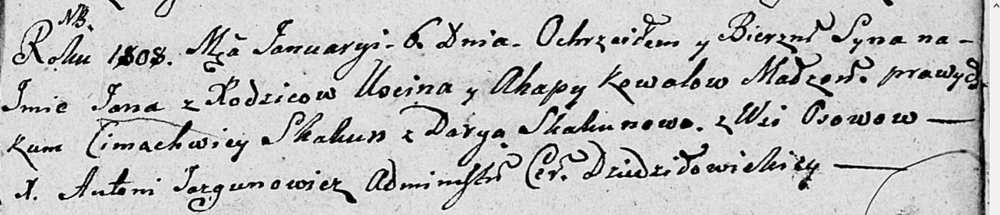

**Коваль Ян Юстынов (Kowal Jan)**

6 января 1808 г -- крещение (НИАБ 136-13-894, лист 64, №1/1808-р
(ориг)).

**НИАБ 136-13-894:** Лист 64. **Метрическая запись №1/1808-р (ориг).**

{width="6.496527777777778in"
height="1.4006856955380578in"}

Дедиловичская Покровская церковь. 6 января 1808 года. Метрическая запись
о крещении.

Kowal Jan -- сын родителей с деревни Осовo.

Kowal Uscin -- отец.

Kowalowa Ahapa -- мать.

Skakun Cimachwiey -- кум.

Skakunowa Darya -- кума.

Jazgunowicz Antoni -- ксёндз.
