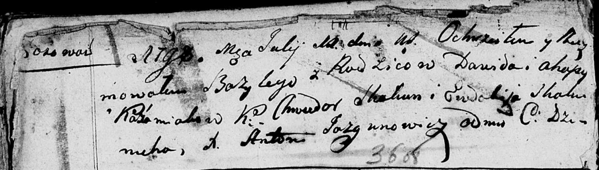

**Кожемяко Базыль Давидов (Każamiaka Bazyli)**

11 июля 1798 г -- крещение (НИАБ 136-13-894, лист 36об, №32/1798-р
(ориг)), (РГИА 823-2-18, лист 264об, №32/1798-р (коп)).

**НИАБ 136-13-894:** 36об. **Метрическая запись №32/1798-р (ориг).**

Дедиловичская Покровская церковь. 11 июля 1798 года. Метрическая запись
о крещении.

Każamiaka Bazyli -- сын родителей с деревни Осовo.

Każamiaka Dawid -- отец.

Każamiakowa Ahapa -- мать.

Skakun Chwiedor - кум.

Skakunicha Ewdokija - кума.

Jazgunowicz Antoni -- ксёндз.

**НИАБ 136-13-894:** Лист 14. **Метрическая запись №53/1791-р (ориг).**

Дедиловичская Покровская церковь. 8 ноября 1791 года. Метрическая запись
о крещении.

Każamiaka Jan -- сын родителей с деревни Осовo.

Każamiaka Dawid -- отец.

Każamiakowa Ahafija -- мать.

Skakun Chwiedor - кум.

Filipczykowa Zynowija - кума.

Jazgunowicz Antoni -- ксёндз.
