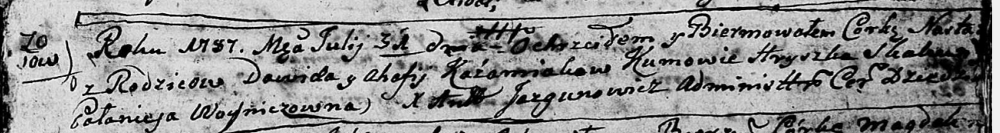

**Кожемяко Настасья Давидова (Każamiakowna Nastazyja)**

31 июля 1787 г -- крещение (НИАБ 136-13-894, лист 2, №34/1787-р (ориг)).

**НИАБ 136-13-894:** Лист 2. **Метрическая запись №34/1787-р (ориг).**

{width="6.496527777777778in"
height="0.8696456692913386in"}

Дедиловичская Покровская церковь. 31 июля 1787 года. Метрическая запись
о крещении.

Każamiakowna Nastazyja -- дочь родителей с деревни Осово.

Każamiaka Dawid -- отец.

Każamiakowa Ahafija -- мать.

Skakun Hryszka -- кум.

Woyniczowna Połonieja - кума.

Jazgunowicz Antoniusz -- ксёндз.
