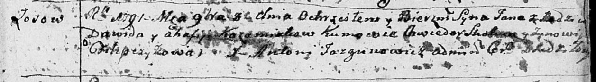

**Кожемяко Ян Давидов (Każamiaka Jan)**

8 ноября 1791 г -- крещение (НИАБ 136-13-894, лист 14, №53/1791-р
(ориг)).

**НИАБ 136-13-894:** Лист 14. **Метрическая запись №53/1791-р (ориг).**

Дедиловичская Покровская церковь. 8 ноября 1791 года. Метрическая запись
о крещении.

Każamiaka Jan -- сын родителей с деревни Осовo.

Każamiaka Dawid -- отец.

Każamiakowa Ahafija -- мать.

Skakun Chwiedor - кум.

Filipczykowa Zynowija - кума.

Jazgunowicz Antoni -- ксёндз.
