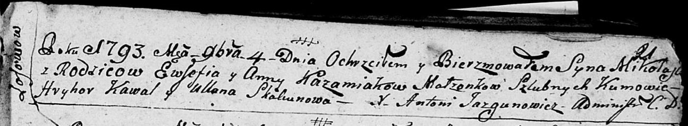
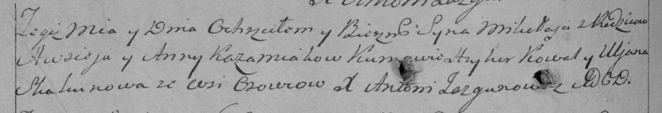

**Кожемяка Анна (Każamiakowa Anna)**

4 ноября 1793 г -- крещение сына Миколая (НИАБ 136-13-894, лист 21,
№81/1793-р (ориг)), (РГИА 823-2-18, лист 248об, №47/1793-р (коп)).

**НИАБ 136-13-894:** Лист 21. **Метрическая запись №81/1793-р (ориг).**

Дедиловичская Покровская церковь. 4 ноября 1793 года. Метрическая запись
о крещении.

Każamiaka Mikołay -- сын родителей с деревни Осовo.

Każamiaka Ewsefi -- отец.

Każamiakowa Anna-- мать.

Kawal Hryhor - кум.

Skakunowa Ullana - кума.

Jazgunowicz Antoni -- ксёндз.

**РГИА 823-2-18:** Лист 248об. **Метрическая запись №47/1793-р (коп).**

Дедиловичская Покровская церковь. 20 ноября 1793 года. Метрическая
запись о крещении.

Każamiako Mikołay -- сын родителей с деревни Осово.

Każamiako Awsiey -- отец.

Każamiakowa Anna -- мать.

Kowal Hryhor -- кум.

Skakunowa Uljana -- кума.

Jazgunowicz Antoni -- ксёндз.
