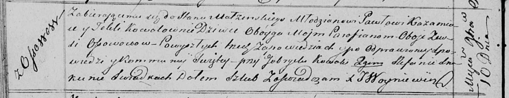

**Кожемяко Павел (Każamiaka Paweł)**

10 ноября 1818 г -- венчание с девкой Теклей Коваль с деревни Осово
(НИАБ 136-13-920, лист 25об, №8/1818-б (ориг)).

**НИАБ 136-13-894:** Лист 25об. **Метрическая запись №8/1818-б (ориг).**

Осовская Покровская церковь. 10 ноября 1818 года. Запись о венчании.

Każamiaka Paweł -- жених, молодой, парафии Осовской, с деревни Осово.

Kowalowna Tekla -- невеста, девка, парафии Осовской, с деревни Осово.

Kowal Gabriel -- свидетель.

Skakun Stefan -- свидетель.

Woyniewicz Tomasz -- ксёндз.
