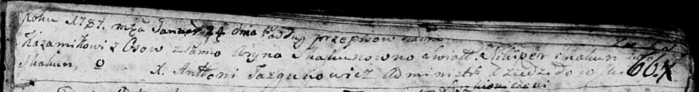
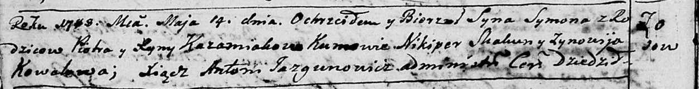
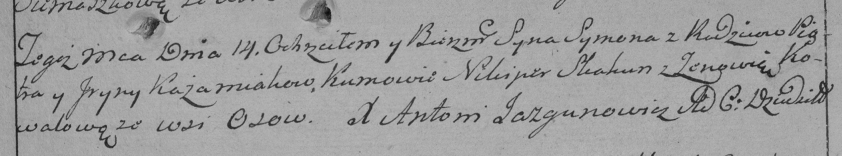

**Кожемяко (Скакунова) Рына (Każamiakowa Ryna, Aryna z Skakunow)**

24 января 1787 г -- венчание с Петром Кожемякой с деревни Осово (НИАБ
136-13-894, лист 66, №1/1787-б (ориг)).

14 мая 1788 г -- крещение сына Сымона (НИАБ 136-13-894, лист 4об,
№32/1788-р (ориг)), (РГИА 823-2-18, лист 236, №16/1788-р (коп)).

**НИАБ 136-13-894:** Лист 66. **Метрическая запись №1/1787-б (ориг).**

Дедиловичская Покровская церковь. 24 января 1787 года. Метрическая
запись о венчании.

Każamiaka \[Piotr\] -- жених с деревни Осово.

Skakunowna Aryna -- невеста.

Skakun Nikiper -- свидетель.

Skakun -- свидетель.

Jazgunowicz Antoni -- ксёндз.

**НИАБ 136-13-894:** Лист 4-об. **Метрическая запись №32/1788-р
(ориг).**

Дедиловичская Покровская церковь. 14 мая 1788 года. Метрическая запись о
крещении.

Każamiaka Symon -- сын родителей с деревни Осово.

Każamiaka Piotr-- отец.

Każamiakowa Ryna -- мать.

Skakun Nikiper - кум.

Kowalowa Zynowija - кума.

Jazgunowicz Antoni -- ксёндз.

**РГИА 823-2-18:** Лист 236. **Метрическая запись №16/1788-р (коп).**

Дедиловичская Покровская церковь. 14 мая 1788 года. Метрическая запись о
крещении.

Każamiaka Symon -- сын родителей с деревни Осово.

Każamiaka Piotr -- отец.

Każamiakowa Jryna -- мать.

Skakun Nikiper -- кум.

Kowalowa Zenowia - кума.

Jazgunowicz Antoni -- ксёндз.
