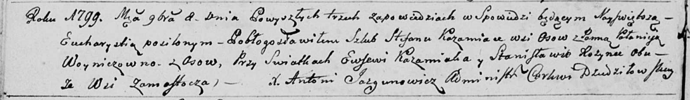
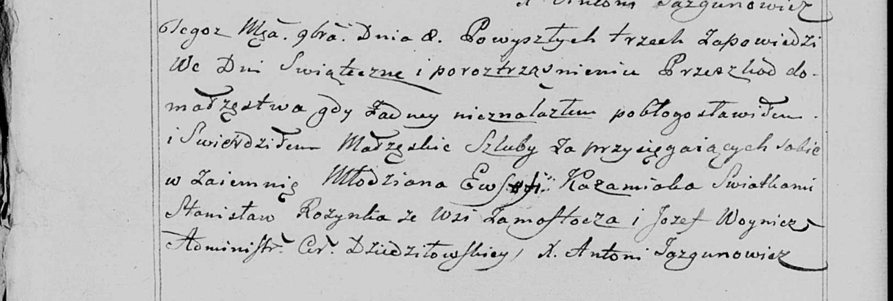
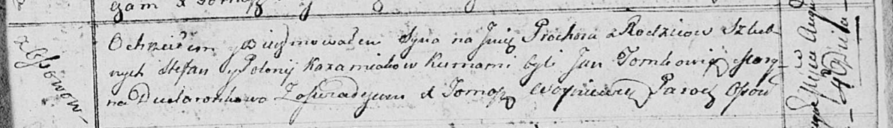
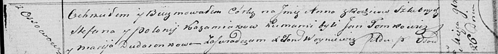

**Кожемяко Стефан (Każamiaka Stefan)**

8 ноября 1799 г -- венчание с Полонеей Войнич с деревни Осово (НИАБ
136-13-920, лист 6об, №6/1799-б (ориг), НИАБ 136-13-938, лист 248об,
№6/1799-б (коп)).

4 августа 1813 г -- крещение сына Прохора (НИАБ 136-13-894, лист 87,
№22/1813-р (ориг)).

26 ноября 1820 г -- крещение дочери Анны (НИАБ 136-13-894, лист 105,
№42/1820-р (ориг)).

**НИАБ 136-13-920:** Лист 6об. **Метрическая запись №6/1799-б (ориг).**

Дедиловичская Покровская церковь. 8 ноября 1799 года. Метрическая запись
о венчании.

Każamiaka Stefan -- жених, деревня Осовo.

Woyniczowna Połonieja -- невеста, деревня Осовo.

Każamiaka Ewsewi -- свидетель, деревня Замосточье.

Rozynka Stanisław -- свидетель, деревня Замосточье.

Jazgunowicz Antoni -- ксёндз.

**НИАБ 136-13-938:** Лист 248об. **Метрическая запись №6/1799-б (коп).**

(См. тж. НИАБ 136-13-920, лист 6об, №6/1799-б (ориг))

Дедиловичская Покровская церковь. 8 ноября 1799 года. Метрическая запись
о венчании.

Każamiaka Ewsefi \[Stefan\] -- жених, молодой, с деревни \[Осово\].

\[Woyniczowna Połonieja\] -- невеста, с деревни \[Осовo\].

Rozynka Stanisław -- свидетель, с деревни Замосточье.

Woynicz Jozef \[Każamiaka Ewsewi\] -- свидетель, с деревни
\[Замосточье\].

Jazgunowicz Antoni -- ксёндз.

**НИАБ 136-13-894:** Лист 87. **Метрическая запись №22/1813-р (ориг).**

Осовская Покровская церковь. 4 августа 1813 года. Метрическая запись о
крещении.

Każamiaka Prochor -- сын родителей с деревни Осовo.

Każamiaka Stefan -- отец.

Każamiakowa Polonija -- мать.

Tomkowicz Jan -- кум.

Dudaronkowa Maryna -- кума.

Woyniewicz Tomasz -- ксёндз.

**НИАБ 136-13-894:** Лист 105. **Метрическая запись №42/1820-р (ориг).**

Осовская Покровская церковь. 26 ноября 1820 года. Метрическая запись о
крещении.

Każamiakowna Anna -- дочь родителей с деревни Осовo.

Każamiaka Stefan -- отец.

Każamiakowa Połonija -- мать.

Tomkowicz Jan -- кум.

Dudaronkow Marija -- кума.

Woyniewicz Tomasz -- ксёндз.
