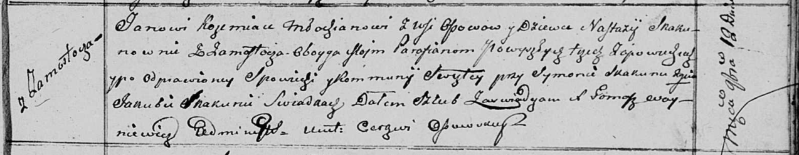
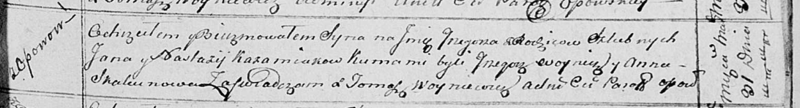

**Кожемяко (в девичестве Скакун) Настасья (Każamiakowa Nastazija z
Skakunow)**

12 ноября 1810 г -- венчание с молодым Яном Кожемякой с деревни Осово
(НИАБ 136-13-920, лист 17, №10/1810-б (ориг)).

31 марта 1814 г -- крещение сына Грыгора (НИАБ 136-13-894, лист 89,
№23/1814-р (ориг)).

**НИАБ 136-13-920:** Лист 17. **Метрическая запись №10/1810-б (ориг).**

Осовская Покровская церковь. 12 ноября 1810 года. Метрическая запись о
венчании.

Kożemiaka Jan -- жених, молодой, парафии Осовской, с деревни Осовo.

Skakunowa Nastazya -- невеста, девка, парафии Осовской, с деревни
Замосточье.

Skakun Symon -- свидетель.

Skakun Jakub -- свидетель.

Woyniewicz Tomasz -- ксёндз.

**НИАБ 136-13-894:** Лист 89. **Метрическая запись №23/1814-р (ориг).**

Осовская Покровская церковь. 31 марта 1814 года. Метрическая запись о
крещении.

Każamiaka Grzegorz -- сын родителей с деревни Осовo.

Każamiaka Jan -- отец.

Każamiakowa Nastazija -- мать.

Woynicz Grzegorz -- кум.

Skakunowa Anna -- кума.

Woyniewicz Tomasz -- ксёндз.
