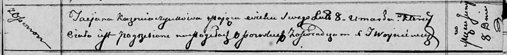

**Козакевич? Татьяна (Kazacieczyukowa? Тaciana)**

8 июня 1812 г -- отпевание, умерла в возрасте 8 лет (родилась около 1804
г) (НИАБ 136-13-919, лист 24, №9/1812-у (ориг)).

**НИАБ 136-13-919:** Лист 24. **Метрическая запись №9/1812-у (ориг).**

Осовская униатская церковь. 8 июня 1812 года. Метрическая запись об
отпевании.

Kazacieczyukowa? Taciana -- умершая, 8 лет, с деревни Осово, похоронена
на кладбище деревни Осово.

Woyniewicz Tomasz -- ксёндз.
