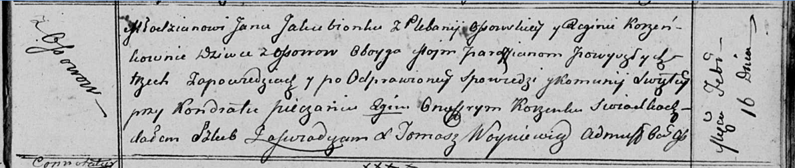

**Якубёнок (в девичестве Коренько) Регина (Jakubionkowa Regina z
Korzeńkow)**

16 февраля 1813 г -- венчание с молодым Яном Якубёнком с деревни Осово
(НИАБ 136-13-920, лист 19, №3/1813-б (ориг)).

**НИАБ 136-13-920:** Лист 19. **Метрическая запись №3/1813-б (ориг).**

Осовская Покровская церковь. 16 февраля 1813 года. Запись о венчании.

Jakubionek Jan -- жених, молодой, парафии Осовской, плебания Осовская, с
деревни Осово.

Korzeńkowna Regina -- невеста, девка, парафии Осовской, с деревни Осово.

Pieczań Kondrat -- свидетель.

Korzenka Onufry -- свидетель.

Woyniewicz Tomasz -- ксёндз.
