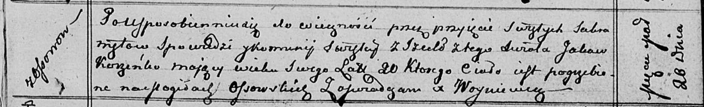

**Коренько Яков (Koreńko Jakow)**

20 марта 1813 г -- отпевание, умер в возрасте 20 лет (родился около 1793
г) (НИАБ 136-13-919, лист 26, №26/1813-у (ориг)).

**НИАБ 136-13-919:** Лист 26. **Метрическая запись №26/1813-у (ориг).**

Осовская униатская церковь. 20 марта 1813 года. Метрическая запись об
отпевании.

Koreńko Jakow -- умерший, 20 лет, с деревни Осово, похоронен на кладбище
деревни Осово.

Woyniewicz Tomasz -- ксёндз.
