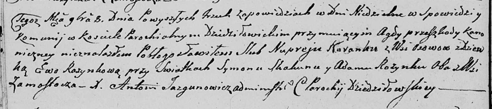

**Коренько (в девичестве Розынко) Ева (Karańkowa Ewa z Rozynkow)**

8 ноября 1808 г -- венчание с девкой Евой Розынко (НИАБ 136-13-920, лист
14об, №13/1808-б (ориг)).

**НИАБ 136-13-920:** Лист 14об. **Метрическая запись №13/1808-б
(ориг).**

{width="6.496527777777778in"
height="1.4509744094488188in"}

Дедиловичская Покровская церковь. 8 ноября 1808 года. Метрическая запись
о венчании.

Karańko Nuprey -- жених, с деревни Осовo.

Rozynkowa Ewa -- невеста, девка.

Skakun Symon -- свидетель, с деревни Замосточье.

Rozynka Adam -- свидетель, с деревни Замосточье.

Jazgunowicz Antoni -- ксёндз.
