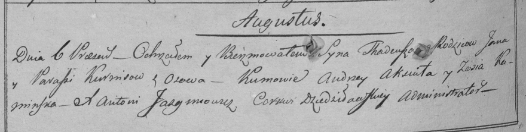

**Курнеш Ян (Kurnesz Jan)**

6 августа 1798 г -- крещение сына Тадея (НИАБ 136-13-894, лист 36об,
№34/1798-р (ориг)), (РГИА 823-2-18, лист 264об, №34/1798-р (коп)).

**НИАБ 136-13-894:** Лист 36об. **Метрическая запись №34/1798-р
(ориг).**

{width="6.496527777777778in"
height="1.0547047244094487in"}

Дедиловичская Покровская церковь. 6 августа 1798 года. Метрическая
запись о крещении.

Kurnesz Thadeusz -- сын родителей с деревни Осовo.

Kurnesz Jan -- отец.

Kurneszowa Paraska -- мать.

Axiuta Andrzey - кум.

Kaminska Zosia - кума.

Jazgunowicz Antoni -- ксёндз.

**РГИА 823-2-18:** Лист 264об. **Метрическая запись №34/1798-р (коп).**

{width="6.496527777777778in"
height="1.6388888888888888in"}

Дедиловичская Покровская церковь. 6 августа 1798 года. Метрическая
запись о крещении.

Kurnesz Thadeusz -- сын родителей с деревни Осово.

Kurniesz Jan -- отец.

Kurnieszowa Paraska -- мать.

Aksiuta Andrzey -- кум.

Kaminska Zosia -- кума.

Jazgunowicz Antoni -- ксёндз.
