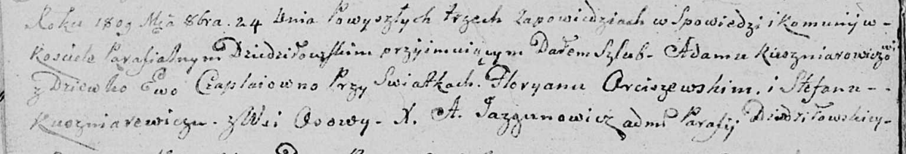

**Кушнеревич Стефан (Kuszniarewicz Stefan)**

24 октября 1809 г -- свидетель венчания Адама Кушнеревича с деревни
Дедиловичи с девкой Евой Чапляй (НИАБ 136-13-920, лист 15об, №13/1809-б
(ориг)).

**НИАБ 136-13-920:** Лист 15об. **Метрическая запись №13/1809-б
(ориг).**

{width="6.496527777777778in"
height="1.1090157480314962in"}

Дедиловичская Покровская церковь. 24 октября 1809 года. Метрическая
запись о венчании.

Kuszniarewicz Adam -- жених, с деревни \[Дедиловичи\].

Czaplajowna Ewa -- невеста, девка.

Arciszewski Fłoryan -- свидетель.

Kuszniarewicz Stefan -- свидетель, с деревни Осово.

Jazgunowicz Antoni -- ксёндз.
