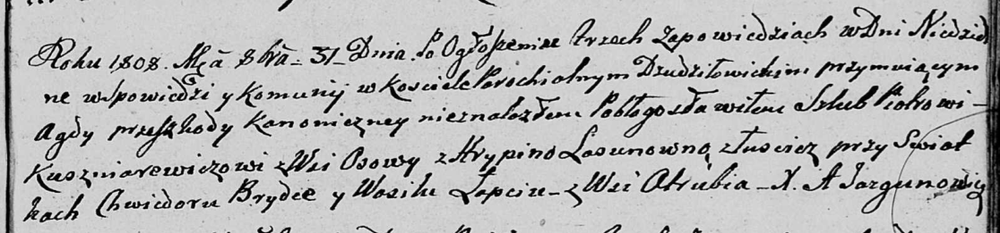

**Кушнеревич Пётр (Kuszniarewicz Piotr)**

31 октября 1808 г -- венчание с Грыпиной Лясун с деревни Лустичи (НИАБ
136-13-920, лист 14, №7/1808-б (ориг)).

**НИАБ 136-13-920:** Лист 14. **Метрическая запись №7/1808-б (ориг).**

{width="6.496527777777778in"
height="1.5193657042869642in"}

Дедиловичская Покровская церковь. 31 октября 1808 года. Метрическая
запись о венчании.

Kuszniarewicz Piotr -- жених, с деревни Осовo.

Lasunowna Hrypina -- невеста, с деревни Лустичи.

Brytka Piotr -- свидетель.

Łapac Wasil -- свидетель, с деревни Отруб.

Jazgunowicz Antoni -- ксёндз.
