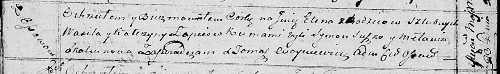

**Лапец Катерына (Lapciowa Katerzyna)**

23 мая 1815 г -- крещение дочери Елены (НИАБ 136-13-894, лист 92об,
№28/1815-р (ориг)).

**НИАБ 136-13-894:** Лист 92об. **Метрическая запись №28/1815-р
(ориг).**

{width="6.496527777777778in"
height="0.9682097550306211in"}

Осовская Покровская церковь. 23 мая 1815 года. Метрическая запись о
крещении.

Łapciowna Elena -- дочь родителей с деревни Осовo.

Łapiec Wasil -- отец.

Łapciowa Katerzyna -- мать.

Suszko Symon -- кум.

Skakunowa Mełania -- кума.

Woyniewicz Tomasz -- ксёндз.
