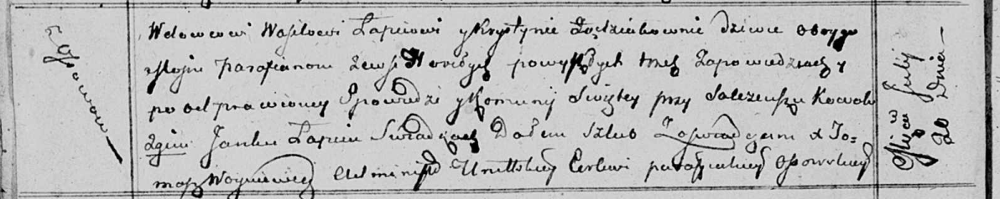
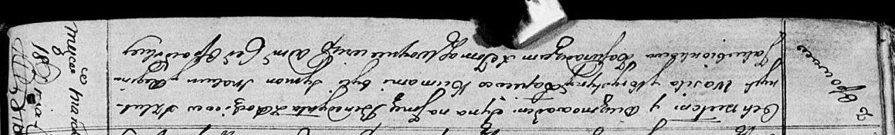

**Лапец Василь (Lapieć Wasil)**

20 июля 1813 г -- венчание с девкой Крыстыной Зондзёнок с деревни
Горелое (НИАБ 136-13-920, лист 19об, №10/1813-б (ориг)).

18 марта 1817 г -- крещение сына Бенедыкта (НИАБ 136-13-894, лист 95об,
№19/1817-р (ориг)).

**НИАБ 136-13-920:** Лист 19об. **Метрическая запись №10/1813-б
(ориг).**

Осовская Покровская церковь. 20 июля 1813 года. Запись о венчании.

Łapac Wasil -- жених, вдовец, парафии Осовской, с деревни Осово.

Ządziоkowna Krystyna -- невеста, девка, парафии Осовской, с деревни
Горелое.

Kowal Salczeusz -- свидетель.

Łapac Janka -- свидетель.

Woyniewicz Tomasz -- ксёндз.

**НИАБ 136-13-894:** Лист 95об. **Метрическая запись №19/1817-р
(ориг).**

Осовская Покровская церковь. 18 марта 1817 года. Метрическая запись о
крещении.

Łapieć Benedykt -- сын родителей с деревни Осовo.

Łapieć Wasil -- отец.

Łapćiowa Krystyna -- мать.

Skakun Symon -- кум.

Jakubionkowa Regina -- кума.

Woyniewicz Tomasz -- ксёндз.
