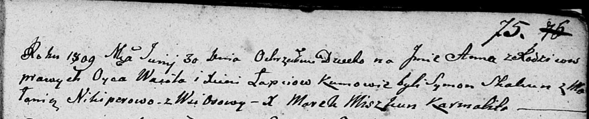

**Лапец Анна Василева (Lapсiowna Anna)**

30 июня 1809 г -- крещение (НИАБ 136-13-894, лист 75, №32/1809-р
(ориг)).

**НИАБ 136-13-894:** Лист 75. **Метрическая запись №32/1809-р (ориг).**

{width="6.496527777777778in"
height="1.312849956255468in"}

Дедиловичская Покровская церковь. 30 июня 1809 года. Метрическая запись
о крещении.

Łapciowna Anna -- дочь родителей с деревни Осовo.

Łapać Wasil -- отец.

Łapciowa Xienia -- мать.

Skakun Symon -- кум.

Nikiperowa Malania -- кума.

Miszkun Marek -- ксёндз.
