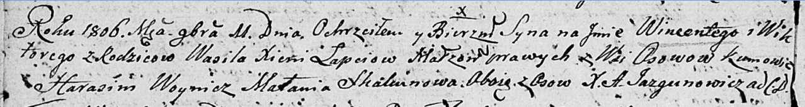
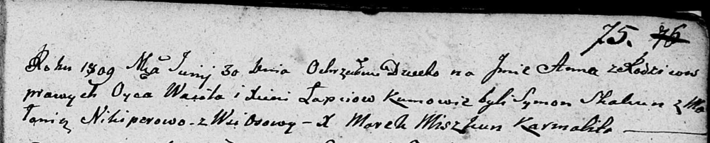
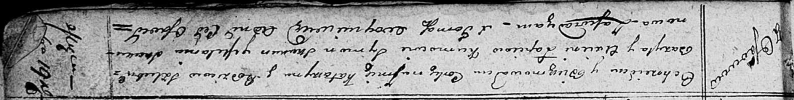

**Лапец Василь (Lapieć Wasil, Bazyl)**

11 ноября 1806 г -- крещение сына Винцентыя Викторыя (НИАБ 136-13-894,
лист 61об, №49/1806-р (ориг)).

30 июня 1809 г -- крещение дочери Анны (НИАБ 136-13-894, лист 75,
№32/1809-р (ориг)).

19 ноября 1811 г -- крещение дочери Катерыны (НИАБ 136-13-894, лист 82,
№57/1811-р (ориг)).

**НИАБ 136-13-894:** Лист 61об. **Метрическая запись №49/1806-р
(ориг).**

Дедиловичская Покровская церковь. 11 ноября 1806 года. Метрическая
запись о крещении.

Łapać Wincenty Wiktory -- сын родителей с деревни Осовo.

Łapać Wasil -- отец.

Łapaciowa Xienia -- мать.

Woynicz Harasim -- кум, с деревни Осовo.

Skakunowa Małania -- кума, с деревни Осовo.

Jazgunowicz Antoni -- ксёндз.

**НИАБ 136-13-894:** Лист 75. **Метрическая запись №32/1809-р (ориг).**

Дедиловичская Покровская церковь. 30 июня 1809 года. Метрическая запись
о крещении.

Łapciowna Anna -- дочь родителей с деревни Осовo.

Łapać Wasil -- отец.

Łapciowa Xienia -- мать.

Skakun Symon -- кум.

Nikiperowa Malania -- кума.

Miszkun Marek -- ксёндз.

**НИАБ 136-13-894:** Лист 82. **Метрическая запись №57/1811-р (ориг).**

Осовская Покровская церковь. 19 ноября 1811 года. Метрическая запись о
крещении.

Łapciowna Katarzyna -- дочь родителей с деревни Осовo.

Łapiec Bazyl -- отец.

Łapciowa Axienia -- мать.

Skakun Symon -- кум.

Skakunowa Mełanija -- кума.

Woyniewicz Tomasz -- ксёндз.
