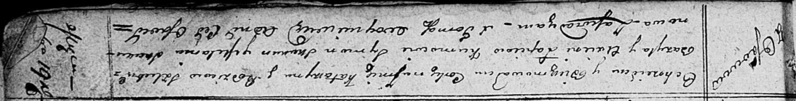

**Лапец Катерына Василева (Lapсiowna Katarzyna)**

19 ноября 1811 г -- крещение (НИАБ 136-13-894, лист 82, №57/1811-р
(ориг)).

**НИАБ 136-13-894:** Лист 82. **Метрическая запись №57/1811-р (ориг).**

Осовская Покровская церковь. 19 ноября 1811 года. Метрическая запись о
крещении.

Łapciowna Katarzyna -- дочь родителей с деревни Осовo.

Łapiec Bazyl -- отец.

Łapciowa Axienia -- мать.

Skakun Symon -- кум.

Skakunowa Mełanija -- кума.

Woyniewicz Tomasz -- ксёндз.
