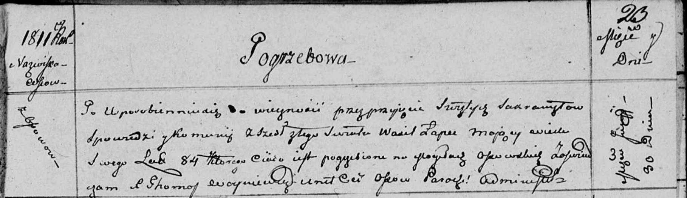

**Лапец Василь (Lapeć Wasil)**

30 июня 1811 г -- отпевание, умер в возрасте 84 года (родился около 1727
г) (НИАБ 136-13-919, лист 23, №14/1811-у (ориг)).

**НИАБ 136-13-919:** Лист 23. **Метрическая запись №14/1811-у (ориг).**

Осовская униатская церковь. 30 июня 1811 года. Метрическая запись об
отпевании.

Łapec Wasil -- умерший, 84 года, с деревни Осово, похоронен на кладбище
деревни Осово.

Woyniewicz Tomasz -- ксёндз.
