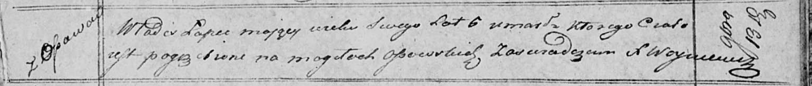

**Лапец Владысь (Lapieć Władis)**

13 ноября 1821 г -- отпевание, умер в возрасте 6 лет (родился около 1815
г) (НИАБ 136-13-919, лист 35, №11/1821-у (ориг)).

**НИАБ 136-13-919:** Лист 35. **Метрическая запись №11/1821-у (ориг).**

Осовская униатская церковь. 13 ноября 1821 года. Метрическая запись об
отпевании.

Łapiec Władis -- умерший, 6 лет, с деревни Осово, похоронен на кладбище
деревни Осово.

Woyniewicz Tomasz -- ксёндз.
